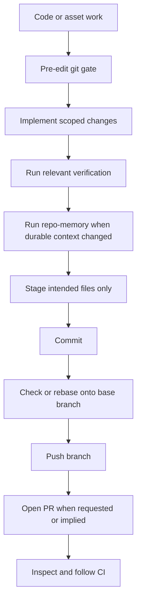

# git-delivery

> Branch-aware delivery workflow for safe editing, commits, pushes, pull
> requests, and CI follow-up.

## What it does

`git-delivery` manages the git lifecycle around code and asset work. It checks
branch state before edits, protects unrelated dirty work, starts from the right
base when safe, and turns submit, push, ship, or PR requests into an intentional
delivery path with verification and CI follow-up.



## Installation

```bash
npx skills add deweyou/agents --skill git-delivery
```

For repository-wide setup, prefer:

```bash
deweyou-cli agent init --skills git-delivery
```

## Features

- Runs a pre-edit base gate before new coding, asset, skill, rule, or workflow
  changes.
- Creates a `codex/` task branch from the fetched primary branch when the
  worktree is clean and detached or not explicitly pinned to the current branch.
- Protects unrelated dirty work from branch moves, rebases, staging, and commits.
- Treats delivery phrases such as `提交吧`, `ship it`, `push`, and `开 PR` as
  full delivery intents unless the user narrows the scope.
- Uses `repo-memory` before commits when durable repository knowledge changed.
- Pauses stale CI polling before new delivery commits and follows visible CI
  after push or PR creation.
- Repairs only clear low-risk CI failures; ambiguous behavior changes stop for a
  user decision.

## SOP

1. Check `git status --short --branch`, primary branch, remote, and base state.
2. Fetch the primary branch, usually `origin/main`.
3. If detached or starting fresh from a clean worktree, create a task branch from
   the fetched base.
4. If dirty work exists, protect it and report whether it blocks branch or base
   sync.
5. Make the requested scoped changes.
6. Run relevant lint, test, typecheck, build, or asset validation commands.
7. Run `repo-memory` before delivery when workflow or durable knowledge changed.
8. Stage only intended files, commit, check base compatibility, push, and open a
   PR when requested or implied.
9. Inspect CI after push or PR creation; repair only when the fix is clear and
   low risk.

## Source

This skill is maintained in `deweyou/agents` and indexed by
`deweyou-cli agent update`.
