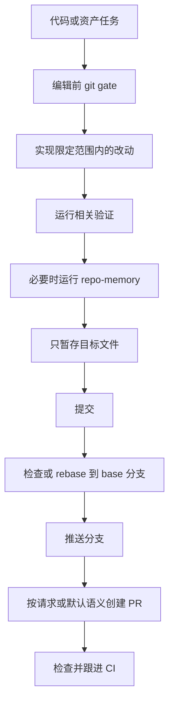

# git-delivery

> 分支感知的交付工作流，用于安全编辑、提交、推送、创建 PR 和跟进 CI。

## 它是做什么的

`git-delivery` 管理代码和资产工作的 git 生命周期。它会在编辑前检查分支状态、保护无关脏改动、在安全时从正确 base 开始，并把提交、推送、发布或 PR 请求转成有验证、有边界的交付流程。



## 安装

```bash
npx skills add deweyou/agents --skill git-delivery
```

仓库级接入更推荐：

```bash
deweyou-cli agent init --skills git-delivery
```

## 特点

- 在新的 coding、asset、skill、rule 或 workflow 变更前运行 pre-edit base gate。
- 当工作区干净且处于 detached 或未明确要求沿用当前分支时，从已 fetch 的 primary branch 创建 `codex/` 任务分支。
- 保护无关脏改动，不随意切分支、rebase、stage 或 commit。
- 将 `提交吧`、`ship it`、`push`、`开 PR` 等表达视为完整交付意图，除非用户明确缩小范围。
- 当仓库知识发生持久变化时，在提交前使用 `repo-memory`。
- 在新交付提交前暂停过期 CI 轮询，并在 push 或 PR 后跟进可见 CI。
- 只自动修复明确、低风险的 CI 失败；涉及行为选择的模糊问题会停下来让用户决策。

## SOP

1. 检查 `git status --short --branch`、当前分支、primary branch、remote 和 base 状态。
2. Fetch primary branch，通常是 `origin/main`。
3. 如果处于 detached 或干净工作区的新任务，从 fetched base 创建任务分支。
4. 如果存在脏改动，保护它们，并说明是否阻塞分支或 base 同步。
5. 完成请求范围内的改动。
6. 运行相关 lint、test、typecheck、build 或 asset validation。
7. 如果 workflow 或 durable knowledge 改变，在交付前运行 `repo-memory`。
8. 只暂存目标文件，提交，检查 base 兼容性，push，并在请求或默认语义需要时创建 PR。
9. Push 或 PR 后检查 CI；只有修复明确且低风险时才自动处理。

## Source

This skill is maintained in `deweyou/agents` and indexed by
`deweyou-cli agent update`.
