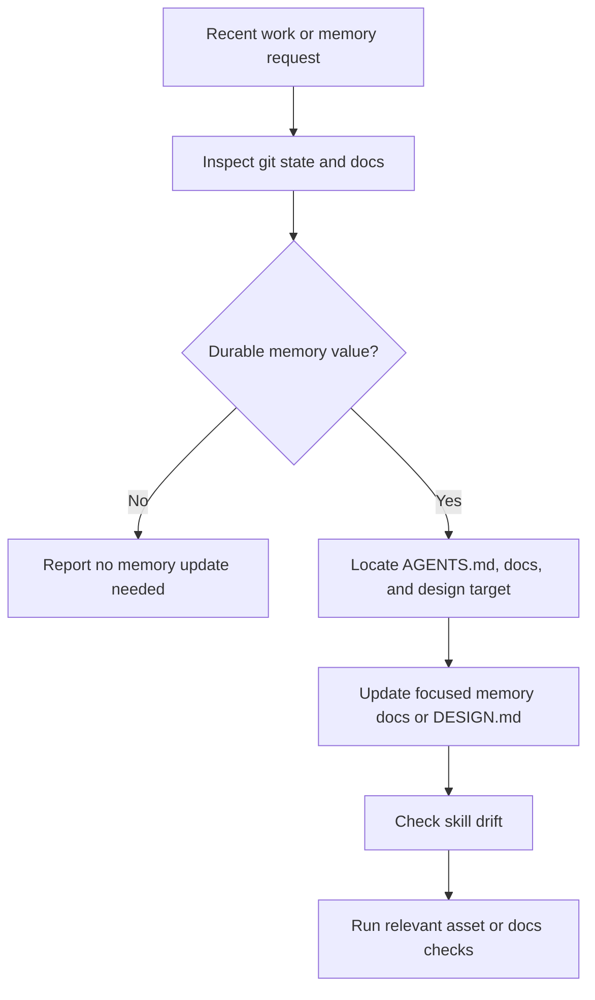

# repo-memory

> Durable repository memory workflow for AGENTS.md, docs, design memory,
> workflow knowledge, and skill drift.

## What it does

`repo-memory` decides whether completed work changed knowledge future agents or
humans should not rediscover from scratch. It initializes or updates repository
memory under `docs/`, keeps `AGENTS.md` as the routing layer, maintains UI
design memory through `DESIGN.md` or existing design docs when relevant, applies
the knowledge documentation quality bar, and checks whether repository-owned
skills or dependency skills need follow-up.



## Installation

```bash
npx skills add deweyou/agents --skill repo-memory
```

For repository-wide setup, prefer:

```bash
deweyou-cli agent init --skills repo-memory
```

## Features

- Uses `docs/` as the repository knowledge base and `AGENTS.md` as the navigation
  and routing layer.
- Maintains UI design memory in root `DESIGN.md`, an existing design doc, or a
  newly created design contract when relevant.
- Initializes missing memory with focused docs, state, todo, and a safe
  `CLAUDE.md -> AGENTS.md` symlink when possible.
- Applies the documentation rule: Mermaid first, concise prose, relative links
  with `#L` anchors when useful, and an update footer.
- Updates only durable knowledge: intent, invariants, workflows, boundaries,
  recurring pitfalls, and repository-specific commands.
- Skips mechanical or obvious implementation details.
- Checks repository-owned skill drift directly and defers dependency-skill
  changes to issue, PR, TODO, or subagent follow-up.

## SOP

1. Inspect `git status --short`, branch, likely base branch, diff stat, and
   focused diffs.
2. Read `AGENTS.md`, root `DESIGN.md`, existing `docs/`, `CLAUDE.md`, and
   changed workflow or skill files.
3. Decide whether the current work has durable memory value.
4. If memory is missing, initialize the required docs and safe symlink.
5. If memory exists, update only the affected focused docs or design-memory
   target.
6. Apply the doc quality rule: Mermaid diagram first, concise explanation,
   relative links with `#L` anchors when useful, and update footer.
7. When root `DESIGN.md` exists or is created, ensure `AGENTS.md` routes UI/UX
   and visual design changes through it.
8. Check skill drift and record owned updates or dependency follow-ups.
9. Run relevant asset or docs validation before handoff.

## Source

This skill is maintained in `deweyou/agents` and indexed by
`deweyou-cli agent update`.
