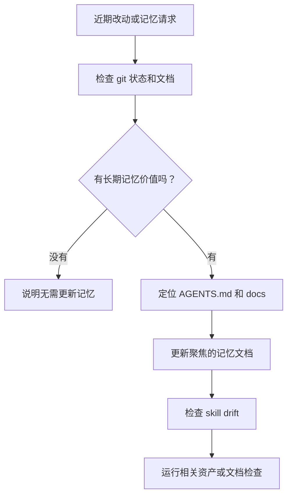

# repo-memory

> 面向 `AGENTS.md`、`docs/`、工作流知识和 skill drift 的仓库长期记忆工作流。

## 它是做什么的

`repo-memory` 判断刚完成的工作是否改变了未来 agent 或人类不应重新摸索的知识。它会初始化或更新 `docs/` 下的仓库记忆，让 `AGENTS.md` 作为路由层，应用知识文档质量标准，并检查仓库自有 skill 或依赖 skill 是否需要跟进。



## 安装

```bash
npx skills add deweyou/agents --skill repo-memory
```

仓库级接入更推荐：

```bash
deweyou-cli agent init --skills repo-memory
```

## 特点

- 使用 `docs/` 作为仓库知识库，使用 `AGENTS.md` 作为导航和路由层。
- 在缺少记忆体系时初始化聚焦文档、状态、TODO，并在安全时创建 `CLAUDE.md -> AGENTS.md` symlink。
- 应用文档规则：Mermaid 开头、简洁说明、必要时使用带 `#L` 的相对链接、更新 footer。
- 只记录长期知识：意图、不变量、工作流、边界、反复踩坑点和仓库特定命令。
- 跳过机械改动或代码中一眼可见的实现细节。
- 直接处理仓库自有 skill drift，将依赖 skill 变更延后为 issue、PR、TODO 或 subagent 后续。

## SOP

1. 检查 `git status --short`、分支、可能的 base branch、diff stat 和聚焦 diff。
2. 阅读 `AGENTS.md`、现有 `docs/`、`CLAUDE.md` 以及变更过的 workflow 或 skill 文件。
3. 判断当前工作是否有长期记忆价值。
4. 如果记忆体系缺失，初始化必要文档和安全 symlink。
5. 如果记忆体系已存在，只更新受影响的聚焦文档。
6. 应用文档质量规则：Mermaid 图开头、简洁说明、必要时相对链接带 `#L`、更新 footer。
7. 检查 skill drift，并记录自有更新或依赖后续事项。
8. 交付前运行相关 asset 或 docs 验证。

## Source

This skill is maintained in `deweyou/agents` and indexed by
`deweyou-cli agent update`.
