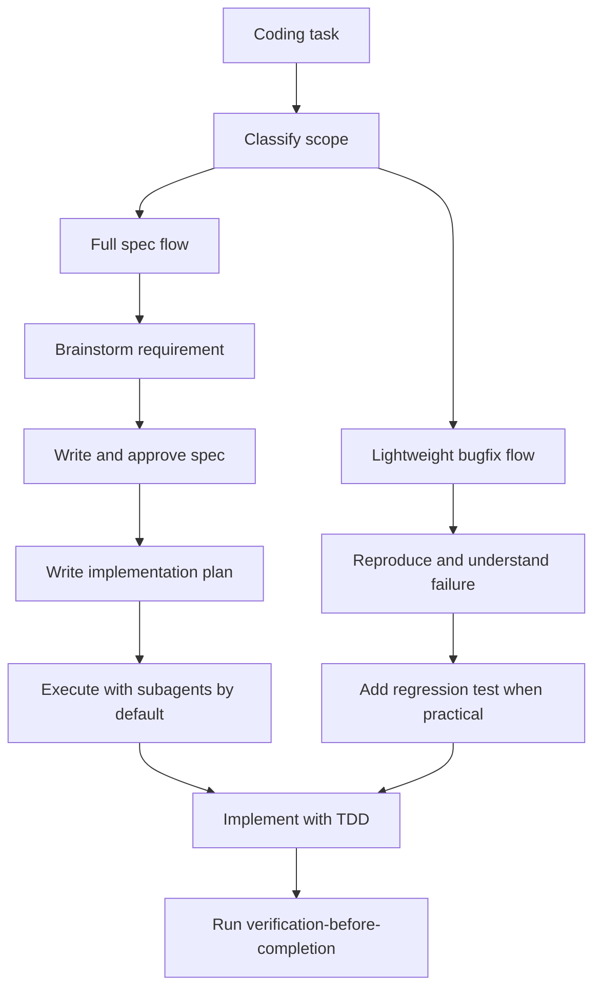

# spec-driven-coding

> Spec-first coding workflow for features, behavior changes, multi-step work,
> TDD, and verification.

## What it does

`spec-driven-coding` keeps implementation aligned before code changes begin. It
classifies the task, uses Superpowers brainstorming/spec/plan workflows when the
work is feature-shaped or ambiguous, defaults approved plans to subagent-driven
execution, keeps simple bugfixes lighter, and requires tests plus verification
before claiming completion.



## Installation

```bash
npx skills add deweyou/agents --skill spec-driven-coding
```

For repository-wide setup, prefer:

```bash
deweyou-cli agent init --skills spec-driven-coding
```

## Features

- Classifies work into full spec flow, lightweight bugfix flow, or no coding
  flow.
- Requires Superpowers brainstorming, writing-plans, test-driven-development,
  systematic-debugging, and verification-before-completion when available.
- Defers implementation until the spec and plan are aligned for features,
  behavior changes, and ambiguous tasks.
- Defaults approved implementation plans to subagent-driven development; inline
  execution is an explicit fallback.
- Keeps simple bugfixes focused on reproduction, regression tests, the smallest
  responsible fix, and targeted verification.
- Updates specs or repo memory when requirements or durable behavior change.

## SOP

1. Classify the task before editing.
2. For full spec flow, check required Superpowers skills, brainstorm, write the
   spec, get approval, write the implementation plan, and execute it with
   subagent-driven development by default.
3. For lightweight bugfixes, reproduce the issue and add a regression test when
   practical.
4. Implement with TDD or focused verification where tests cannot cover the risk.
5. Keep edits scoped to the approved requirement and plan.
6. Update the spec when requirements change during implementation.
7. Run verification-before-completion and relevant project checks.
8. Run `repo-memory` when the work changed durable repository knowledge.

## Source

This skill is maintained in `deweyou/agents` and indexed by
`deweyou-cli agent update`.
