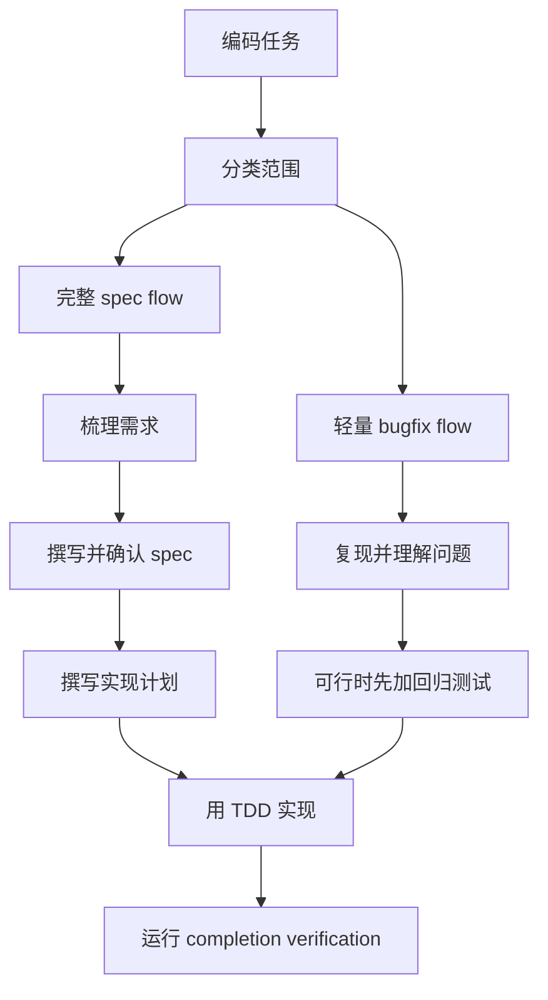

# spec-driven-coding

> 面向功能、行为变更、多步骤工作、TDD 和验证的 spec-first coding 工作流。

## 它是做什么的

`spec-driven-coding` 确保实现开始前需求已经对齐。它会先分类任务，对功能型或模糊任务使用 Superpowers 的 brainstorming/spec/plan 工作流，对简单 bugfix 保持轻量，并要求测试和验证完成后才能宣称完成。



## 安装

```bash
npx skills add deweyou/agents --skill spec-driven-coding
```

仓库级接入更推荐：

```bash
deweyou-cli agent init --skills spec-driven-coding
```

## 特点

- 将工作分类为完整 spec flow、轻量 bugfix flow 或非编码 flow。
- 在可用时要求 Superpowers 的 brainstorming、writing-plans、test-driven-development、systematic-debugging 和 verification-before-completion。
- 对功能、行为变更和模糊任务，在 spec 与 plan 对齐前不开始实现。
- 简单 bugfix 聚焦复现、回归测试、最小责任边界修复和目标验证。
- 当需求或长期行为变化时，更新 spec 或 repo memory。

## SOP

1. 编辑前先分类任务。
2. 对完整 spec flow，检查必需 Superpowers skills，brainstorm，写 spec，获得确认，再写实现计划。
3. 对轻量 bugfix，复现问题，并在可行时添加回归测试。
4. 用 TDD 实现；当测试无法覆盖风险时，使用聚焦验证。
5. 将改动限制在已确认的需求和计划内。
6. 实现过程中需求变化时，同步更新 spec。
7. 运行 verification-before-completion 和相关项目检查。
8. 当工作改变仓库长期知识时运行 `repo-memory`。

## Source

This skill is maintained in `deweyou/agents` and indexed by
`deweyou-cli agent update`.
