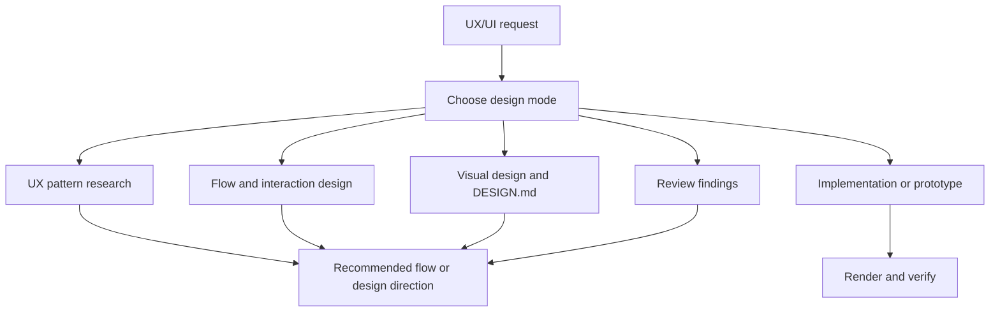

# ui-design

> UX/UI workflow for research, interaction design, visual systems,
> implementation, reviews, and AI design prompts.

## What it does

`ui-design` turns UX and interface-quality expectations into an executable
workflow. It covers pattern research, flow and state design, visual styling,
project `DESIGN.md` contracts, platform-specific implementation, reviews, and
Sleek or other AI design prompts while keeping usability separate from visual
taste.



## Installation

```bash
npx skills add deweyou/agents --skill ui-design
```

For repository-wide setup, prefer:

```bash
deweyou-cli agent init --skills ui-design
```

## Features

- Covers web, H5/mobile web, native apps, HarmonyOS, mini programs, macOS,
  dashboards, tools, component libraries, onboarding, settings, empty states, and
  landing pages.
- Chooses among UX research, flow design, visual design, implementation,
  prototype, review, and AI design prompt modes.
- Reads only the relevant references for the task.
- Applies project `DESIGN.md` when visual style, personal taste, component
  fidelity, or design-system persistence matters.
- Requires state coverage for empty, loading, error, success, disabled, selected,
  focus, hover, press, permission, login, and destructive confirmation states
  when relevant.
- Uses rendered or browser verification for significant UI implementation work.

## SOP

1. Classify the request mode and target platform or surface.
2. Identify the user's real workflow and the states it needs.
3. Read the minimal relevant playbook references.
4. Resolve UX structure before visual styling when both are involved.
5. Apply `DESIGN.md` only when the task asks for visual style, system fidelity,
   implementation, or review against a design contract.
6. For implementation, edit the relevant files directly and run the appropriate
   local renderer or browser verification.
7. For reviews, lead with concrete findings ordered by severity and cite files
   when available.
8. Report verification gaps when a surface cannot be rendered or inspected.

## Source

This skill is maintained in `deweyou/agents` and indexed by
`deweyou-cli agent update`.
