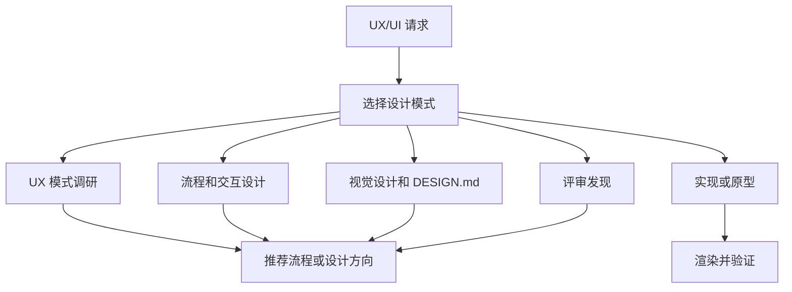

# ui-design

> 面向调研、交互设计、视觉系统、实现、评审和 AI 设计 prompt 的 UX/UI 工作流。

## 它是做什么的

`ui-design` 将 UX 和界面质量要求转成可执行工作流。它覆盖模式调研、流程与状态设计、视觉风格、项目 `DESIGN.md` 契约、平台实现、评审，以及 Sleek 或其他 AI 设计 prompt，同时把可用性和视觉品味分层处理。



## 安装

```bash
npx skills add deweyou/agents --skill ui-design
```

仓库级接入更推荐：

```bash
deweyou-cli agent init --skills ui-design
```

## 特点

- 覆盖 Web、H5/mobile web、原生应用、HarmonyOS、小程序、macOS、dashboard、工具、组件库、onboarding、settings、empty states 和 landing pages。
- 在 UX research、flow design、visual design、implementation、prototype、review 和 AI design prompt 模式之间选择。
- 只读取当前任务需要的 reference。
- 当视觉风格、个人品味、组件一致性或 design-system 持久化相关时，应用项目 `DESIGN.md`。
- 在相关场景覆盖 empty、loading、error、success、disabled、selected、focus、hover、press、permission、login 和 destructive confirmation 状态。
- 对重要 UI 实现使用渲染或浏览器验证。

## SOP

1. 分类请求模式和目标平台或界面。
2. 识别用户真实工作流，以及它需要覆盖的状态。
3. 读取最少且相关的 playbook references。
4. 当 UX 和视觉都相关时，先解决 UX 结构，再处理视觉风格。
5. 只有在任务涉及视觉风格、系统一致性、实现或设计契约评审时应用 `DESIGN.md`。
6. 实现时直接编辑相关文件，并运行合适的本地渲染或浏览器验证。
7. 评审时按严重程度先给具体 findings，并在可用时引用文件。
8. 当界面无法渲染或检查时，说明验证缺口。

## Source

This skill is maintained in `deweyou/agents` and indexed by
`deweyou-cli agent update`.
