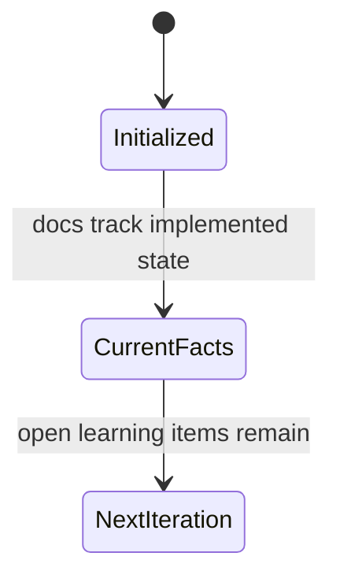

# Knowledge State

- Last reviewed source commit: `0bdb32705e25dec2dcf72d9e1707e355bf2fc345`
- Iteration: `2`
- Last mode: `update`
- Active knowledge directory: `docs/`
- Covered areas: repository structure, current architecture, runtime boundaries, Python API, Tauri command surface, local data initialization, agent navigation
- Open risks: Python service lifecycle is still manual; production data directory migration remains deferred

## Notes

The knowledge base tracks current project facts rather than phase-specific snapshots. Phase-specific material belongs under `docs/superpowers/specs/` and `docs/superpowers/plans/`.

---
*Last updated: 2026-05-10 | Reason: remove phase-specific knowledge docs*
