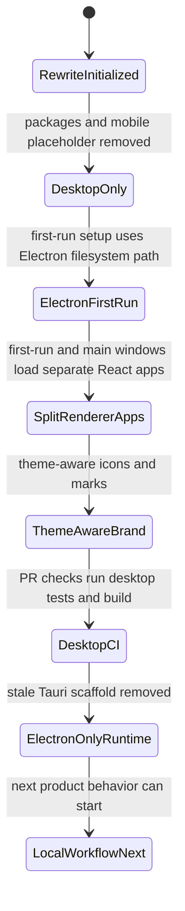

# Knowledge State

- Last reviewed branch: `codex/first-run-onboarding`
- Iteration: `5`
- Active knowledge directory: `docs/`
- Covered areas: desktop-only structure, package extraction rules, mobile
  placeholder policy, Electron first-run workspace setup, split renderer app
  window boundary, theme-aware brand assets, historical runtime cleanup, and
  initial UI design contract
- GitHub Actions CI runs on pull requests and `main` pushes. It installs with
  `pnpm install --frozen-lockfile`, runs `pnpm run check`, and builds the desktop
  app with `pnpm --filter @weave/desktop build`.
- Desktop dependencies must be repository-contained for CI; do not depend on
  machine-local `file:` packages outside this repository.
- First-run setup is designed and implemented as a single-workspace Electron flow:
  the user chooses one local folder, Weave initializes `.weave/`, `notes/`,
  `memos/`, and `todos/`, and later launches open that configured workspace
  directly.
- Current Electron first-run workspace path does not depend on Python agent
  startup or repository-local runtime data setup.
- Electron first-run and main windows are intentionally separate renderer apps:
  first-run loads `first-run.html` / `first-run-app.tsx`, and the main workspace
  loads `main.html` / `main-app.tsx`.
- Weave brand assets are theme-aware where runtime rendering is controlled:
  light uses paper assets, dark uses ink assets, and system follows macOS
  appearance.
- The current desktop runtime is Electron-only. The old Tauri scaffold under
  `apps/desktop/src-tauri/` and the old prototype files directly under
  `apps/desktop/src/` have been removed.
- Open risks: iOS stack is undecided; storage engine is undecided; local-first
  data model is not designed yet; persistence beyond first-run workspace
  initialization is still pending.

---
*Last updated: 2026-06-07 | Reason: record Electron-only cleanup of stale Tauri scaffold*
