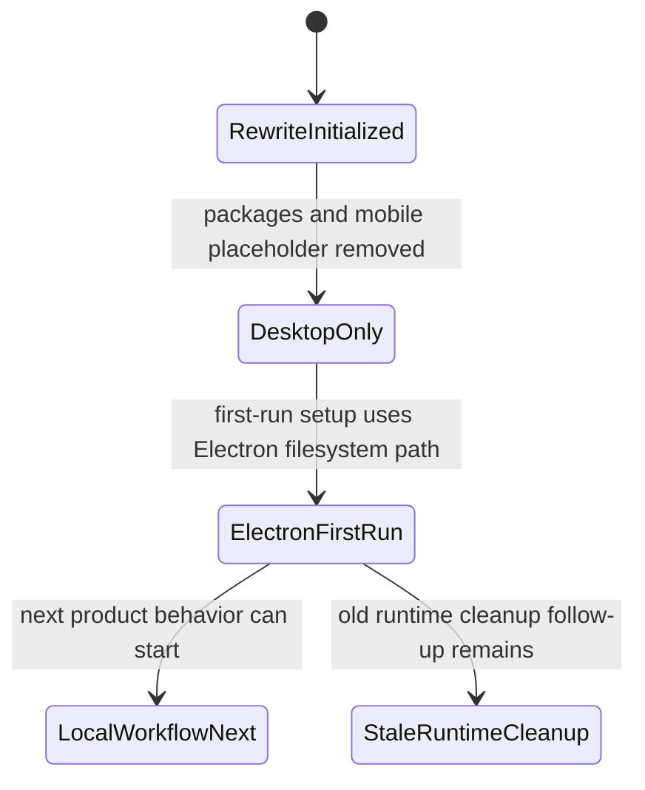

# Knowledge State

- Last reviewed branch: `codex/remove-stale-files`
- Iteration: `3`
- Active knowledge directory: `docs/`
- Covered areas: desktop-only structure, package extraction rules, mobile
  placeholder policy, Electron first-run workspace setup, and initial UI design
  contract
- First-run setup is designed and implemented as a single-workspace Electron flow:
  the user chooses one local folder, Weave initializes `.weave/`, `notes/`,
  `memos/`, and `todos/`, and later launches open that configured workspace
  directly.
- Current Electron first-run workspace path does not depend on Python agent
  startup or repository-local runtime data setup.
- Stale Tauri and old runtime files remain a cleanup follow-up; do not treat the
  old runtime surface as fully removed.
- Open risks: iOS stack is undecided; storage engine is undecided; local-first
  data model is not designed yet; persistence beyond first-run workspace
  initialization is still pending.

---
*Last updated: 2026-06-06 | Reason: clarify current Electron first-run runtime state*
