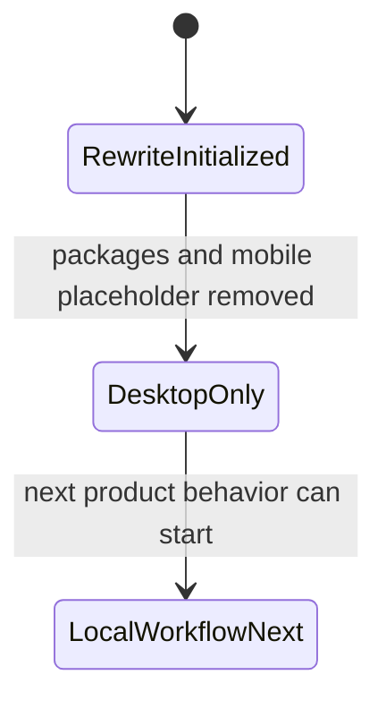

# Knowledge State

- Last reviewed branch: `codex/rewrite-repo`
- Iteration: `2`
- Active knowledge directory: `docs/`
- Covered areas: desktop-only structure, package extraction rules, mobile
  placeholder policy, initial UI design contract
- Open risks: iOS stack is undecided; storage engine is undecided; local-first
  data model is not designed yet

---
*Last updated: 2026-06-06 | Reason: record current repo memory after structure simplification*
