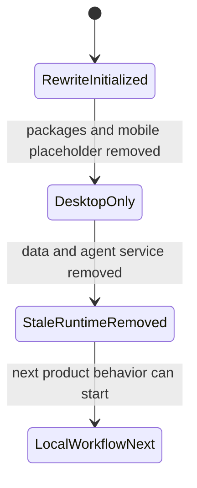

# Knowledge State

- Last reviewed branch: `codex/remove-stale-files`
- Iteration: `3`
- Active knowledge directory: `docs/`
- Covered areas: desktop-only structure, package extraction rules, mobile
  placeholder policy, removed Python agent service and repository-local runtime
  data skeleton, initial UI design contract
- First-run setup is designed and implemented as a single-workspace Electron flow:
  the user chooses one local folder, Weave initializes `.weave/`, `notes/`,
  `memos/`, and `todos/`, and later launches open that configured workspace
  directly.
- Open risks: iOS stack is undecided; storage engine is undecided; local-first
  data model is not designed yet; no persistence path exists after removing the
  placeholder `data/` tree

---
*Last updated: 2026-06-06 | Reason: record single-workspace Electron first-run setup*
