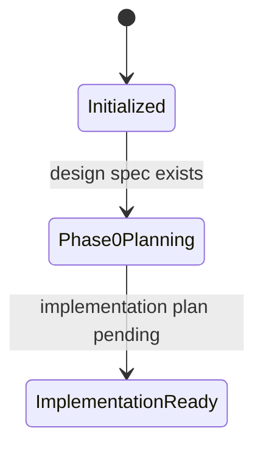

# Knowledge State

- Last reviewed source commit: `ea021f72eef01cd4b2f92bfc748f6f03788e70f3`
- Iteration: `1`
- Last mode: `init`
- Active knowledge directory: `docs/`
- Covered areas: repository structure, Phase 0 runtime boundaries, agent navigation
- Open risks: Rust toolchain is not installed yet; Tauri implementation details are not verified; Python version target needs confirmation during implementation

## Notes

The knowledge base is initialized before application code exists. Current docs intentionally describe target Phase 0 structure and boundaries rather than discovered implementation behavior.

---
*Last updated: 2026-05-10 | Reason: initial knowledge base setup*
