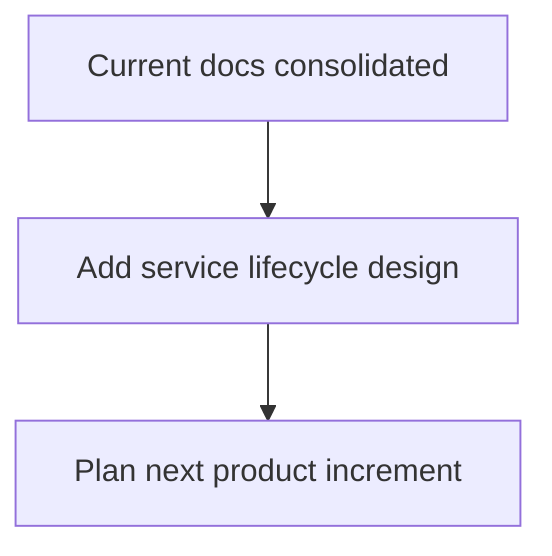

# Knowledge TODO

- [ ] Decide when to add `start_agent_service` process lifecycle management.
- [ ] Document model provider selection, API key storage, session persistence, and first real chat flow before implementing them.

---
*Last updated: 2026-05-10 | Reason: remove phase-specific knowledge docs*
