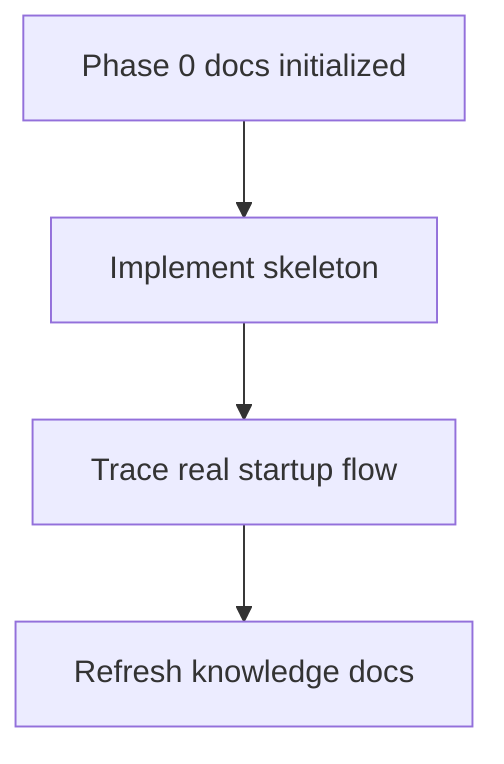

# Knowledge TODO

- [ ] After Tauri is initialized, update [docs/project-structure.md](project-structure.md#L1) with real entry-point files and stable line links.
- [ ] After Rust commands are implemented, update [docs/phase-0-runtime-boundaries.md](phase-0-runtime-boundaries.md#L1) with actual command names, request types, and error behavior.
- [ ] After FastAPI routes are implemented, document the actual request and response schemas.
- [ ] Confirm whether `CLAUDE.md` should remain separate or become a symlink/copy of [AGENTS.md](../AGENTS.md#L1).
- [ ] Decide whether Phase 0 should include `start_agent_service` or keep Python service startup manual until iteration 2.

---
*Last updated: 2026-05-10 | Reason: initial knowledge base setup*

