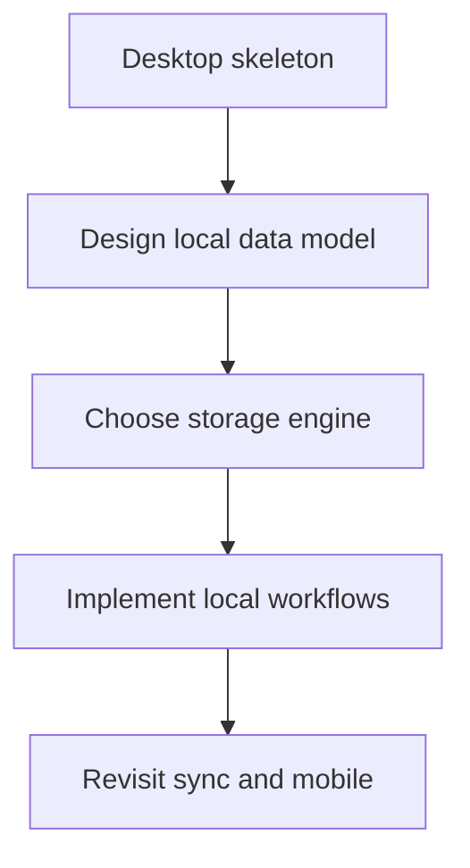

# Knowledge TODO

- [ ] Decide the first local data model for writing documents, memos, and todos.
- [ ] Choose the initial desktop storage engine.
- [ ] Define when writing, memo, and todo content should share one item model or
      stay separate.
- [ ] Revisit `apps/mobile` only when iOS implementation begins.
- [ ] Revisit `packages/*` only when a second consumer or stable repeated
      boundary exists.

---
*Last updated: 2026-06-06 | Reason: record unresolved architecture decisions after simplification*
