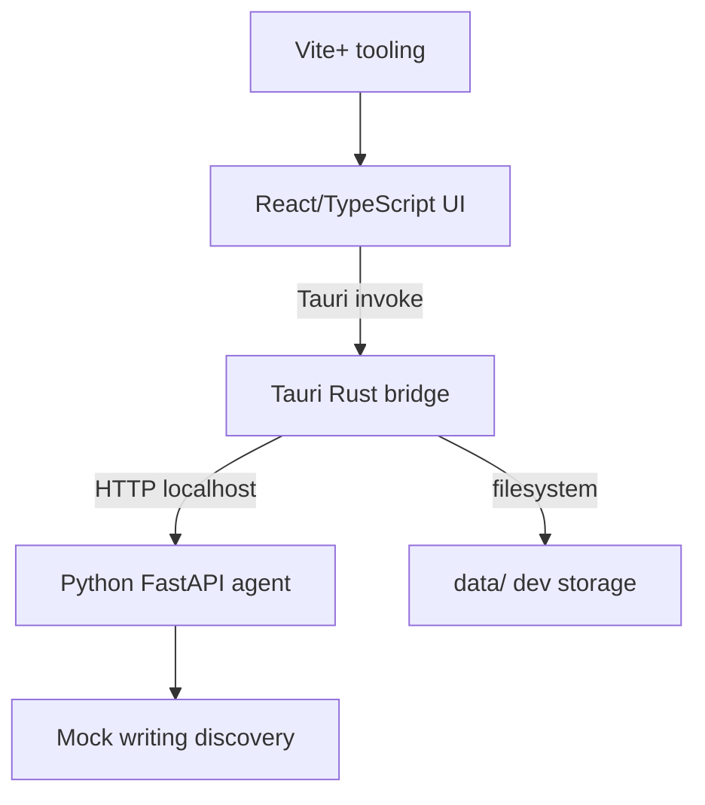
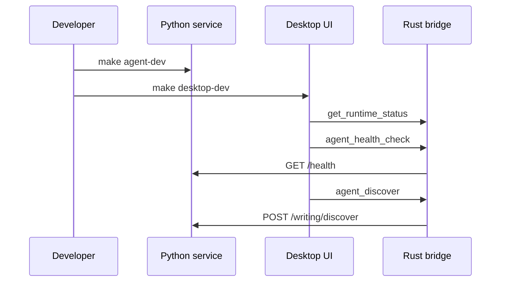

# Current Architecture

Weave is a local-first desktop app with a thin React UI, a Rust/Tauri bridge for desktop-local responsibilities, and a Python FastAPI service for agent behavior. The current implementation validates the shape of the system with mock writing-discovery behavior rather than real model calls.

## Runtime Shape

- Vite+ manages JavaScript workspace tooling and commands.
- React renders the desktop verification UI in [apps/desktop/src/App.tsx](../apps/desktop/src/App.tsx#L1).
- Tauri registers Rust commands in [apps/desktop/src-tauri/src/lib.rs](../apps/desktop/src-tauri/src/lib.rs#L1).
- Rust handles command orchestration, local data setup, and Python service forwarding.
- Python exposes agent HTTP routes from [services/agent/app/main.py](../services/agent/app/main.py#L1).
- `data/` is repository-local development runtime state.

## Startup Flow

Python service startup is manual today. The expected product direction is for the desktop app to own service lifecycle later, while still keeping Python implementation details behind Rust commands.

## Architecture Decisions Kept Current

- The frontend must call Python through Rust commands, never through hardcoded Python URLs.
- Python is the home for future model, memory, and agent workflow behavior.
- Rust is the home for local filesystem setup and service/process boundaries.
- Shared schemas are deferred until repeated cross-runtime duplication appears.
- LangChain and LangGraph are deferred until workflow complexity justifies them.

## Verification

- `make agent-test` verifies the FastAPI contract.
- `pnpm --filter @weave/desktop typecheck` verifies frontend types.
- `pnpm --filter @weave/desktop build` verifies the Vite app builds.
- `cd apps/desktop/src-tauri && cargo check` verifies Rust/Tauri compiles.

---
*Last updated: 2026-05-10 | Reason: consolidate current architecture facts*

