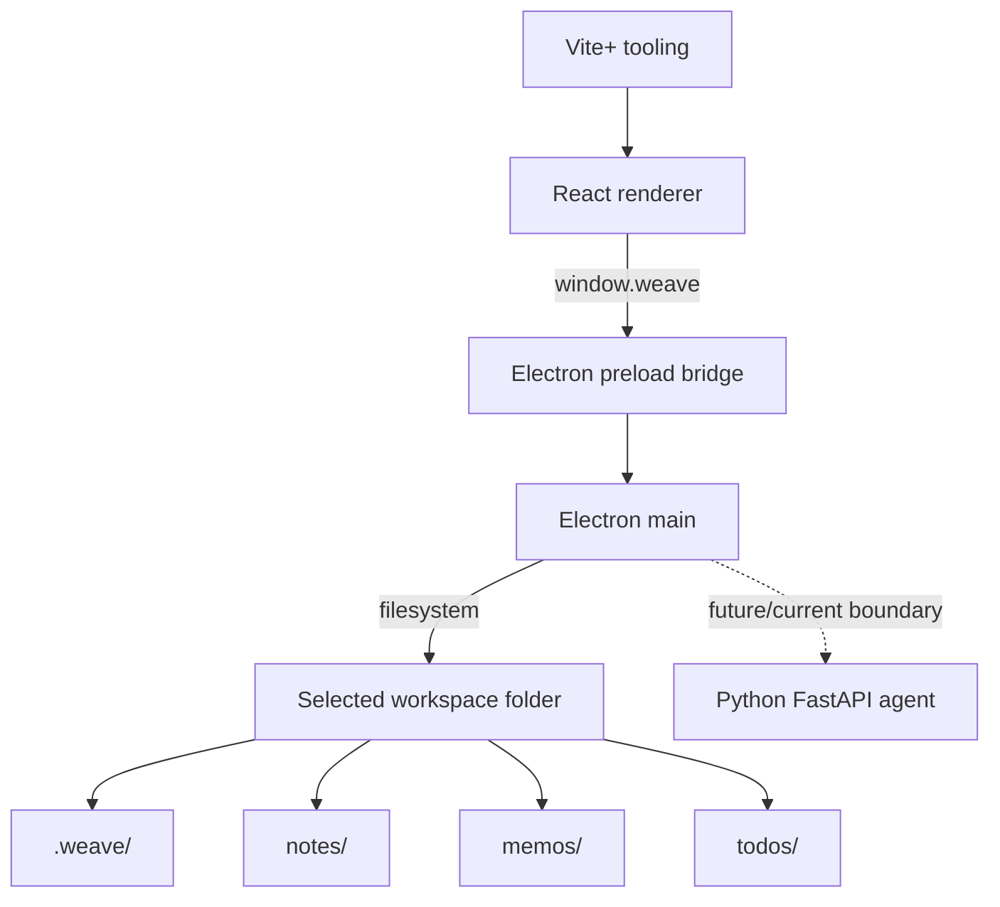
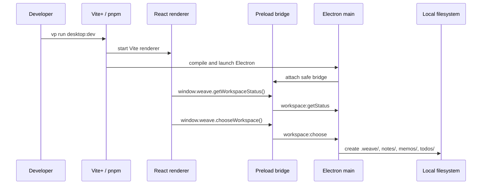

# Current Architecture



Weave is a local-first desktop app with a React UI running behind an Electron
preload bridge. Electron main owns desktop-local responsibilities: native
dialogs, app-local workspace config, filesystem setup, and the boundary where a
Python FastAPI agent may be called when agent behavior is needed. Workspace setup
is an Electron/filesystem flow and does not require the Python service.

## Runtime Shape

- Vite+ manages JavaScript workspace tooling and commands.
- React renders the desktop UI from
  [apps/desktop/src/renderer/main.tsx](../apps/desktop/src/renderer/main.tsx#L1).
- The renderer calls the safe `window.weave` API exposed by
  [apps/desktop/src/preload/preload.ts](../apps/desktop/src/preload/preload.ts#L1).
- Electron main owns window startup, IPC handlers, native folder selection, and
  filesystem setup under
  [apps/desktop/src/main/](../apps/desktop/src/main/main.ts#L1).
- Shared TypeScript contracts live in
  [apps/desktop/src/shared/desktop-api.ts](../apps/desktop/src/shared/desktop-api.ts#L1).
- Python FastAPI agent behavior remains outside first-run workspace setup and
  should stay behind the desktop boundary when reintroduced or called.

## Workspace Flow



The user chooses one local workspace folder on first run. Weave initializes this
single workspace structure:

```text
SelectedFolder/
  .weave/
    config.json
    indexes/
    logs/
  notes/
  memos/
  todos/
```

Later launches read the configured workspace path from Electron app-local config
and open that workspace directly when it is available.

## Architecture Decisions Kept Current

- The renderer reaches native capabilities only through the preload bridge.
- Electron main owns filesystem setup and native dialogs.
- Workspace initialization is local and does not require Python service startup.
- Python remains the boundary for future model, memory, and agent workflow
  behavior when that behavior is present.
- Shared schemas stay local to `apps/desktop/src/shared/` until repeated
  cross-runtime duplication proves a broader boundary.

## Verification

- `pnpm --filter @weave/desktop typecheck` verifies desktop TypeScript.
- `pnpm --filter @weave/desktop test` verifies desktop unit behavior.
- Manual Electron verification checks first-run folder choice, workspace
  initialization, and later launch behavior.

---
*Last updated: 2026-06-06 | Reason: refresh runtime architecture for Electron single-workspace first run*
