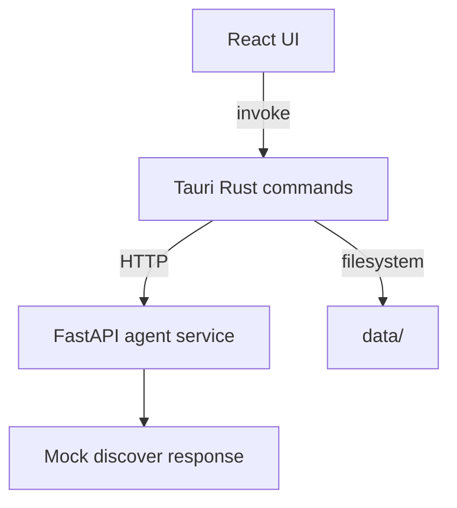
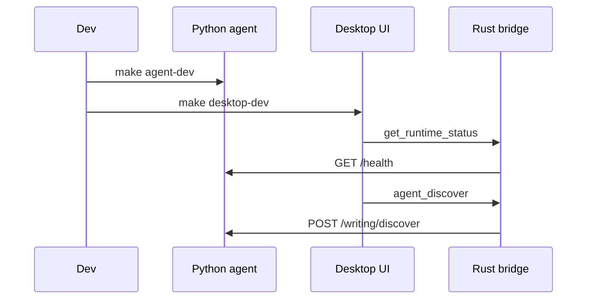

# Phase 0 Architecture

Phase 0 validates the runtime split for Weave without implementing the final writing-agent product. The React UI stays thin, Rust owns desktop-local concerns, and Python owns agent-facing behavior.

## Runtime Boundaries

- React renders status, input, and discover results.
- Rust exposes Tauri commands and hides Python URL details from the frontend.
- Python exposes `/health`, `/echo`, and `/writing/discover`.
- `data/` is repository-local development state.

## Startup

The first implementation starts the Python service manually. Rust service lifecycle management can be added after the bridge is stable.

## Verification

- `make agent-test` confirms the FastAPI contract.
- `cargo check` confirms Rust commands compile.
- `make desktop-dev` confirms the UI can call Rust and display Python results.

---
*Last updated: 2026-05-10 | Reason: Phase 0 implementation docs*
