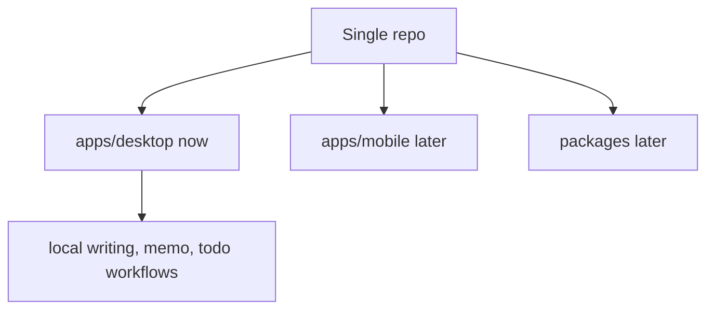

# 0001. Use a Single Repo With a Desktop-First Shape

## Decision

Use one pnpm/Vite+ repository for Weave, but keep the current structure
desktop-only. Do not keep empty `apps/mobile` or preemptive `packages/*`
directories.

## Rationale

The product needs shared domain language across writing, memos, todos, local
storage, and future sync. A single repo keeps those contracts visible without
forcing separate repository coordination before the product shape is clear.

Empty app and package directories create false boundaries before there is real
reuse. The current desktop app should prove the local workflow first.

## Consequences

- `apps/desktop` can move quickly with Electron and React.
- `apps/mobile` will be created only when iOS implementation starts.
- `packages/*` will be created only when reuse or a stable boundary proves it.

---
*Last updated: 2026-06-06 | Reason: replace premature package/mobile structure with desktop-first rules*
