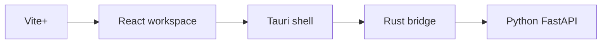

# 0001: Runtime Split For Phase 0

## Decision

Weave Phase 0 uses Vite+ for JavaScript workspace tooling, Tauri/React for the desktop app, Rust for local bridge responsibilities, and Python/FastAPI for the agent service.

## Rationale

- Vite+ keeps JavaScript setup and workspace commands simple.
- Tauri gives Weave a local-first desktop shell with Rust integration.
- Rust is the right place for local filesystem setup and process/service boundaries.
- Python is the right place for future model, memory, and agent workflow work.

## Consequences

- The frontend must call Python through Rust commands.
- Python service startup can remain manual in Phase 0.
- Shared schemas are deferred until repeated cross-runtime duplication appears.
- LangChain and LangGraph are deferred until workflow complexity justifies them.

---
*Last updated: 2026-05-10 | Reason: record Phase 0 runtime decision*
