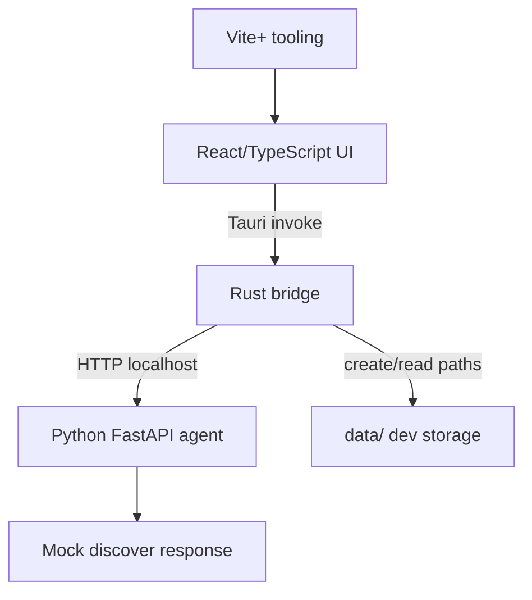
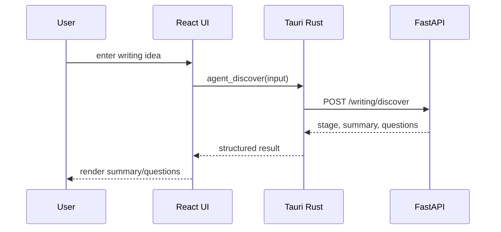

# What Owns Each Phase 0 Runtime Boundary?

Phase 0 proves Weave's runtime split without implementing the full writing agent. Each layer has one narrow responsibility so later model, memory, and workflow work has a stable place to land.

## Boundary Rules

- React owns display and user interaction only.
- Rust owns the Tauri command surface, local filesystem setup, and forwarding to the Python service.
- Python owns agent-facing HTTP endpoints and mock writing-discovery behavior.
- Vite+ owns JavaScript workspace tooling, not app business logic.
- Local data under `data/` is development runtime state and should be initialized predictably.

## Critical Flow

The frontend must not hardcode `127.0.0.1:8765` or call `/writing/discover` directly. That detail belongs behind Rust commands so future process management, port selection, and service packaging can change without rewriting UI code.

## Phase 0 Command Surface

Rust should expose only these initial commands:

- `get_app_info`
- `get_runtime_status`
- `agent_health_check`
- `agent_discover`
- `get_local_paths`

Python should expose only these initial HTTP routes:

- `GET /health`
- `POST /echo`
- `POST /writing/discover`

`start_agent_service` is intentionally secondary. The first working implementation may require manual `make agent-dev`, then add service lifecycle management after the health and discover bridge is stable.

## Deferred Work

- Real model providers and API keys.
- Memory retrieval, embeddings, indexing, or knowledge ingestion.
- Multi-turn chat, session restore, draft editing, and profile UI.
- LangChain or LangGraph.
- Production application-data directory migration.

## Key Files

- [docs/superpowers/specs/2026-05-10-weave-phase-0-design.md](superpowers/specs/2026-05-10-weave-phase-0-design.md#L1) - scope and acceptance criteria.
- [docs/project-structure.md](project-structure.md#L1) - target repository layout and startup map.
- [AGENTS.md](../AGENTS.md#L1) - root routing instructions for future work.

---
*Last updated: 2026-05-10 | Reason: initial knowledge base setup*

