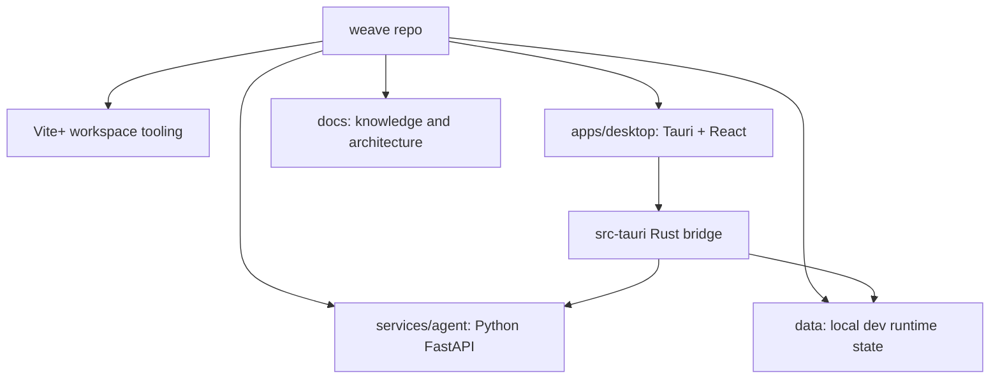
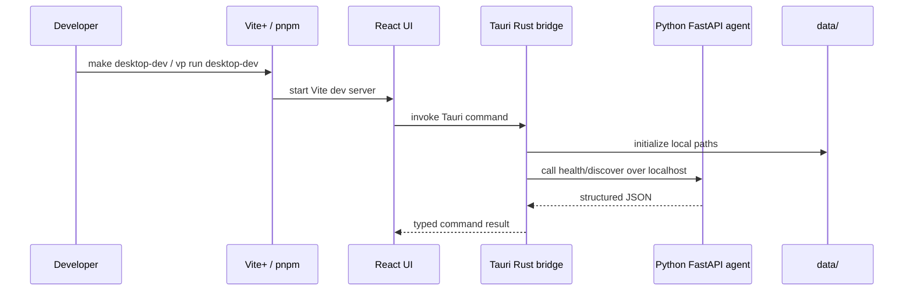

# Project Structure



Weave is planned as a small monorepo where the desktop app, local agent service, runtime data, and knowledge base live together during early development.

## Directory Layout

```text
weave/
  AGENTS.md
  CLAUDE.md
  LICENSE
  package.json
  pnpm-workspace.yaml
  Makefile

  apps/
    desktop/
      src/
      src-tauri/

  services/
    agent/
      app/
      tests/

  data/
    profiles/
    sessions/
    drafts/
    memory/
    indexes/
    logs/

  docs/
    project-structure.md
    phase-0-runtime-boundaries.md
    architecture/
    decisions/
    superpowers/
```

Some paths above are target Phase 0 paths and may not exist until implementation begins. The current repository starts from [AGENTS.md](../AGENTS.md#L1), [CLAUDE.md](../CLAUDE.md#L1), [LICENSE](../LICENSE#L1), and the Phase 0 design spec at [docs/superpowers/specs/2026-05-10-weave-phase-0-design.md](superpowers/specs/2026-05-10-weave-phase-0-design.md#L1).

## Startup Path



Phase 0 may start the Python service manually with `make agent-dev` before launching the desktop app. Rust should still own the bridge between UI and Python so the frontend does not depend on Python port details.

## Ownership Boundaries

- `apps/desktop/src/` owns the minimal React verification UI.
- `apps/desktop/src-tauri/` owns Tauri commands, local data setup, and Python service forwarding.
- `services/agent/app/` owns agent HTTP endpoints and future writing-agent behavior.
- `data/` is development runtime state, not core source code.
- `docs/` owns repository knowledge, architecture notes, decisions, specs, and implementation plans.

## Scope Rules

- Keep Phase 0 changes small enough to verify manually.
- Add shared packages only after there is repeated schema or utility duplication.
- Keep product intent and runtime boundaries documented before adding implementation complexity.

## Key Files

- [AGENTS.md](../AGENTS.md#L1) - root navigation and task routing for agents.
- [docs/phase-0-runtime-boundaries.md](phase-0-runtime-boundaries.md#L1) - runtime ownership and cross-layer rules.
- [docs/superpowers/specs/2026-05-10-weave-phase-0-design.md](superpowers/specs/2026-05-10-weave-phase-0-design.md#L1) - Phase 0 design source of truth.

---
*Last updated: 2026-05-10 | Reason: initial knowledge base setup*

