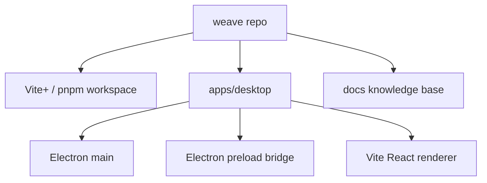
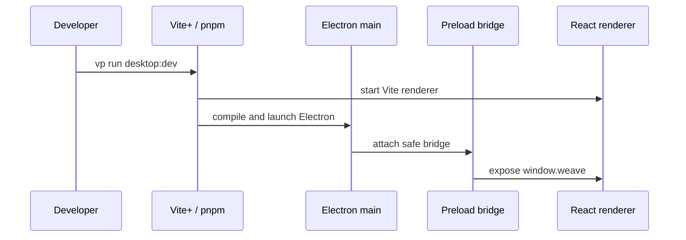

# Project Structure



Weave is currently a desktop-first local app in a single repository. The
workspace is intentionally shallow: one runnable Electron app plus docs.

## Directory Layout

```text
weave/
  AGENTS.md
  DESIGN.md
  README.md
  package.json
  pnpm-workspace.yaml
  tsconfig.base.json

  apps/
    desktop/
      src/
        main/
        preload/
        renderer/
        shared/

  docs/
    project-structure.md
    repository-rules.md
    decisions/
```

## Startup Path



## Ownership Rules

Desktop runtime ownership:

- `apps/desktop/src/renderer/` owns React UI.
- `apps/desktop/src/main/` owns Electron main-process behavior, native dialogs,
  app-local config, and filesystem setup.
- `apps/desktop/src/preload/` owns the safe renderer bridge.
- `apps/desktop/src/shared/` owns shared TypeScript API contracts.

- [apps/desktop/src/main/main.ts#L1](../apps/desktop/src/main/main.ts#L1) owns
  desktop process startup and window creation.
- [apps/desktop/src/preload/preload.ts#L1](../apps/desktop/src/preload/preload.ts#L1)
  owns the safe Electron-to-renderer bridge.
- [apps/desktop/src/renderer/main.tsx#L1](../apps/desktop/src/renderer/main.tsx#L1)
  owns React bootstrapping.
- [apps/desktop/src/shared/desktop-api.ts#L1](../apps/desktop/src/shared/desktop-api.ts#L1)
  owns shared type contracts between preload and renderer.

## Initialized Workspace Structure

```text
SelectedFolder/
  .weave/
    config.json
    indexes/
    logs/
  notes/
  memos/
  todos/
```

## Non-Goals For Now

- No `packages/*` directory until extraction has a real consumer.
- No `apps/mobile` directory until iOS implementation starts.
- No sync, storage engine, or cross-device architecture before local workflows
  are useful.

---
*Last updated: 2026-06-06 | Reason: document Electron runtime ownership and initialized workspace structure*
