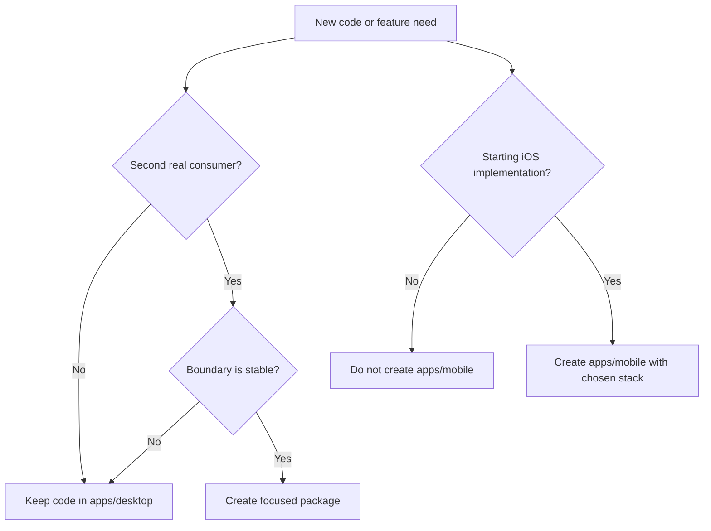

# When Should We Add More Structure?

This repo stays single-repo, but not every future idea gets a directory today.
Structure should follow proven reuse and implementation pressure.

## Package Rules

- Do not create `packages/*` preemptively.
- Keep domain, UI, persistence, and sync code inside `apps/desktop` while the
  desktop app is the only consumer.
- Extract a package only when there is a real second consumer or repeated code
  that has a stable interface.
- When extracting, choose a narrow package name such as `domain`, `storage`, or
  `sync-protocol`; avoid generic names like `utils` or `common`.

## Mobile Rules

- Do not create `apps/mobile` as a placeholder.
- When iOS work starts, create `apps/mobile` in this repo after choosing the
  initial stack.
- Until then, document mobile implications in decisions or rules, not empty app
  directories.

## Local-First Rules

- Local usefulness comes before sync architecture.
- Storage should begin as the simplest desktop-owned implementation that can be
  migrated.
- Sync contracts should appear only when at least two local states need to
  converge.

## Skill Drift

- owned_skill_updates: none
- dependency_skill_followups: none
- policy: Dependency skill changes are deferred to issue/PR/TODO/subagent
  follow-up and are not edited in-place here.

---
*Last updated: 2026-06-06 | Reason: capture rules for avoiding premature packages and mobile placeholders*
