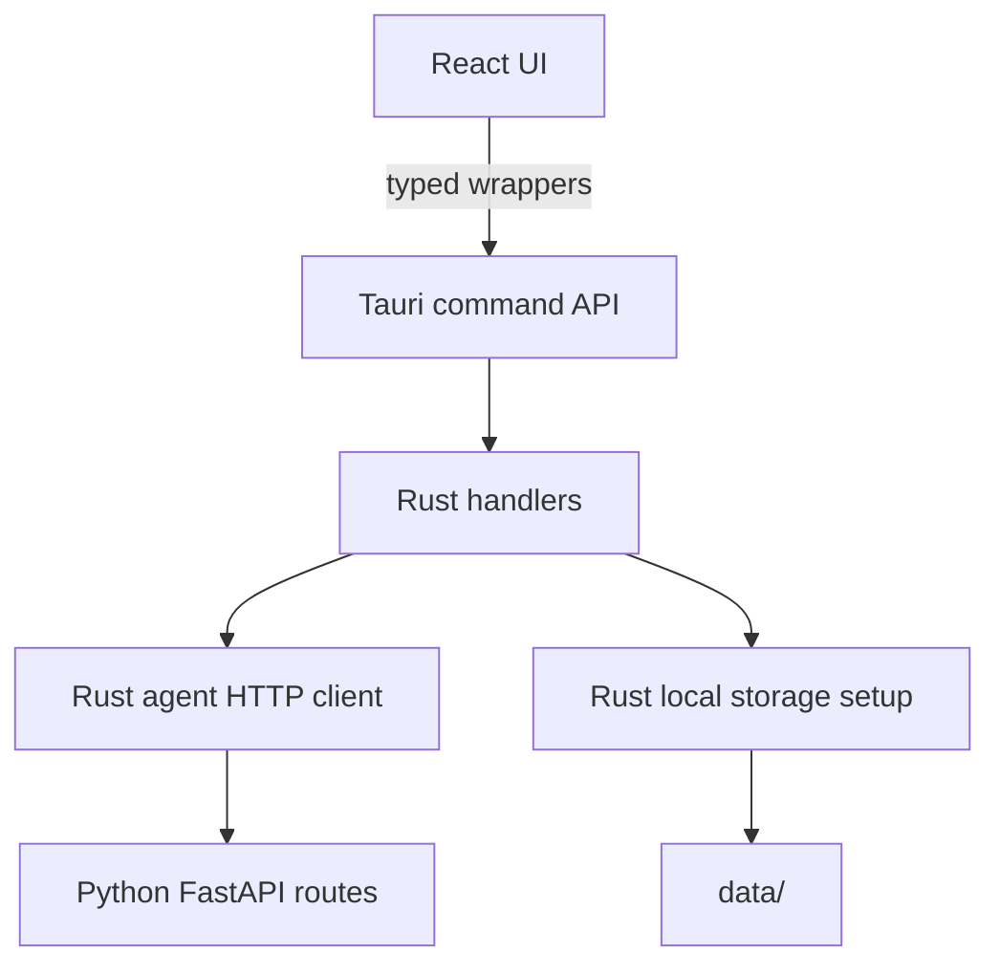
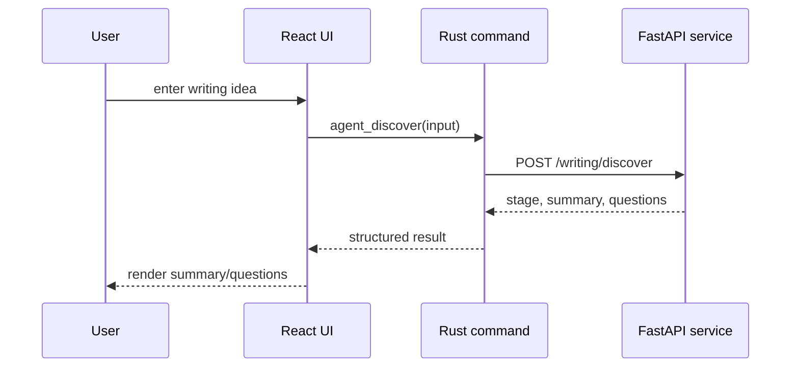

# Runtime Boundaries

This document defines which runtime owns each responsibility. It is a current-facts document, so update it when ownership or command surfaces change.

## Boundary Rules

- React owns display state and user interaction.
- React calls Rust through wrappers in [apps/desktop/src/tauri.ts](../apps/desktop/src/tauri.ts#L1).
- Rust owns the Tauri command surface in [apps/desktop/src-tauri/src/commands.rs](../apps/desktop/src-tauri/src/commands.rs#L1).
- Rust owns local data initialization in [apps/desktop/src-tauri/src/storage.rs](../apps/desktop/src-tauri/src/storage.rs#L1).
- Rust owns Python service forwarding in [apps/desktop/src-tauri/src/agent.rs](../apps/desktop/src-tauri/src/agent.rs#L1).
- Python owns agent-facing routes and schemas in [services/agent/app/main.py](../services/agent/app/main.py#L1) and [services/agent/app/schemas/writing.py](../services/agent/app/schemas/writing.py#L1).

## Current Command Surface

Rust exposes these Tauri commands:

- `get_app_info`
- `get_runtime_status`
- `get_local_paths`
- `agent_health_check`
- `agent_discover`

Python exposes these HTTP routes:

- `GET /health`
- `POST /echo`
- `POST /writing/discover`

## Critical Flow

The frontend must not hardcode `127.0.0.1:8765` or call `/writing/discover` directly. Python URL, port selection, process lifecycle, and packaging details belong behind the Rust boundary.

## Deferred Ownership Changes

- Service lifecycle management should eventually move into Rust/Tauri.
- Production data should eventually move from repository-local `data/` to the platform application data directory.
- Model provider and API-key handling need a dedicated design before implementation.

---
*Last updated: 2026-05-10 | Reason: consolidate current runtime ownership facts*

