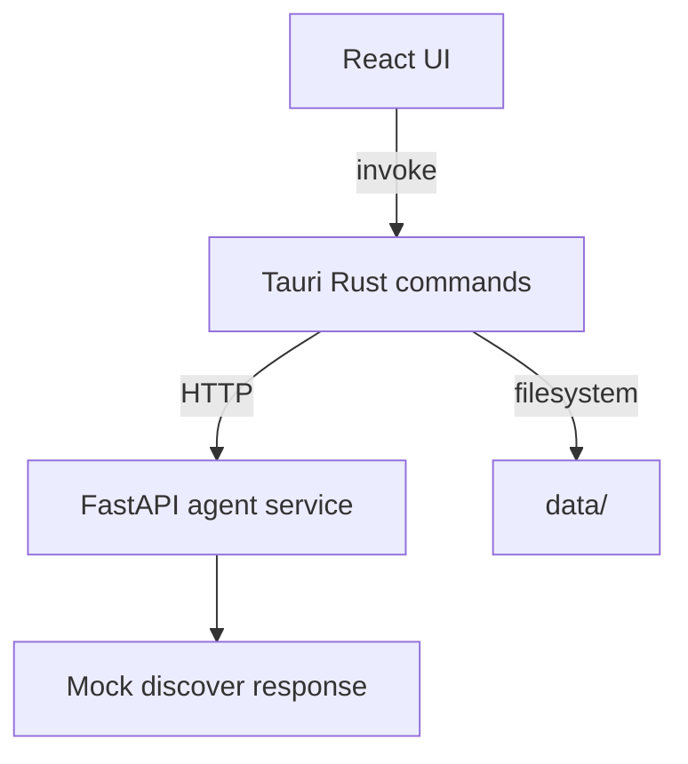
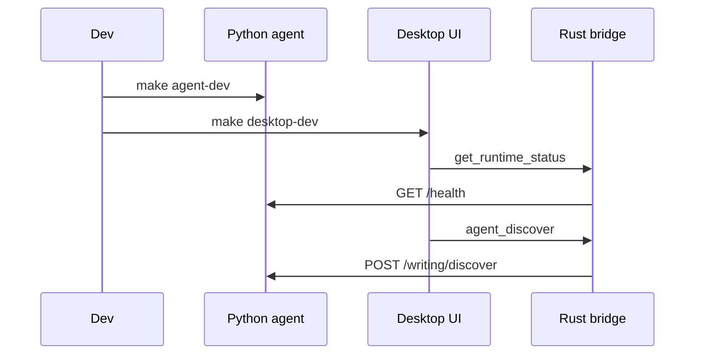
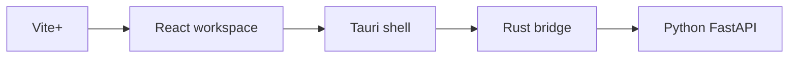

# Weave Phase 0 Implementation Plan

> **For agentic workers:** REQUIRED SUB-SKILL: Use superpowers:subagent-driven-development (recommended) or superpowers:executing-plans to implement this plan task-by-task. Steps use checkbox (`- [ ]`) syntax for tracking.

**Goal:** Build the first runnable Weave skeleton: Vite+ workspace, Tauri/React desktop UI, Rust bridge commands, Python FastAPI mock agent service, local data initialization, and matching docs/knowledge base.

**Architecture:** React calls Tauri commands through `@tauri-apps/api/core.invoke`. Rust owns local filesystem setup and forwards agent requests to a Python FastAPI service on localhost. Vite+ manages JavaScript workspace tasks only; Python and Rust remain independent runtime layers.

**Tech Stack:** Vite+, pnpm, React, TypeScript, Tauri v2, Rust, reqwest, serde, Python 3.11+, FastAPI, Pydantic, pytest.

---

## Source References

- Phase 0 design: `docs/superpowers/specs/2026-05-10-weave-phase-0-design.md`
- Knowledge docs: `docs/project-structure.md`, `docs/phase-0-runtime-boundaries.md`
- Tauri Vite config reference: https://v2.tauri.app/start/frontend/vite/
- Tauri command reference: https://v2.tauri.app/zh-cn/develop/calling-rust/
- FastAPI testing reference: https://fastapi.tiangolo.com/tutorial/testing/

## File Structure

Create or modify these files:

- Root tooling: `.gitignore`, `.editorconfig`, `.env.example`, `package.json`, `pnpm-workspace.yaml`, `Makefile`, `README.md`
- Runtime data: `data/.gitkeep`, `data/profiles/.gitkeep`, `data/sessions/.gitkeep`, `data/drafts/.gitkeep`, `data/memory/.gitkeep`, `data/indexes/.gitkeep`, `data/logs/.gitkeep`
- Python service: `services/agent/pyproject.toml`, `services/agent/app/__init__.py`, `services/agent/app/main.py`, `services/agent/app/schemas/__init__.py`, `services/agent/app/schemas/writing.py`, `services/agent/tests/test_api.py`
- Desktop frontend: `apps/desktop/index.html`, `apps/desktop/package.json`, `apps/desktop/tsconfig.json`, `apps/desktop/vite.config.ts`, `apps/desktop/src/main.tsx`, `apps/desktop/src/App.tsx`, `apps/desktop/src/App.css`, `apps/desktop/src/tauri.ts`, `apps/desktop/src/types.ts`
- Tauri/Rust: `apps/desktop/src-tauri/Cargo.toml`, `apps/desktop/src-tauri/build.rs`, `apps/desktop/src-tauri/tauri.conf.json`, `apps/desktop/src-tauri/capabilities/default.json`, `apps/desktop/src-tauri/src/main.rs`, `apps/desktop/src-tauri/src/lib.rs`, `apps/desktop/src-tauri/src/commands.rs`, `apps/desktop/src-tauri/src/agent.rs`, `apps/desktop/src-tauri/src/storage.rs`
- Architecture docs: `docs/architecture/phase-0.md`, `docs/decisions/0001-runtime-split.md`
- Knowledge docs refresh: `AGENTS.md`, `docs/project-structure.md`, `docs/phase-0-runtime-boundaries.md`, `docs/.state.md`, `docs/.todo.md`

## Task 1: Root Workspace And Repository Skeleton

**Files:**
- Create: `.gitignore`
- Create: `.editorconfig`
- Create: `.env.example`
- Create: `package.json`
- Create: `pnpm-workspace.yaml`
- Create: `Makefile`
- Create: runtime data `.gitkeep` files

- [ ] **Step 1: Create root workspace files**

Write `.gitignore`:

```gitignore
.DS_Store
node_modules/
dist/
target/
*.log

.env
.venv/
__pycache__/
.pytest_cache/
.ruff_cache/

apps/desktop/src-tauri/target/
services/agent/.venv/

data/**/*.json
!data/profiles/default.json
!data/**/.gitkeep
```

Write `.editorconfig`:

```ini
root = true

[*]
charset = utf-8
end_of_line = lf
insert_final_newline = true
indent_style = space
indent_size = 2

[*.py]
indent_size = 4

[Makefile]
indent_style = tab
```

Write `.env.example`:

```bash
WEAVE_AGENT_HOST=127.0.0.1
WEAVE_AGENT_PORT=8765
WEAVE_DATA_DIR=./data
```

Write `package.json`:

```json
{
  "name": "weave",
  "private": true,
  "version": "0.1.0",
  "type": "module",
  "packageManager": "pnpm@10.32.1",
  "scripts": {
    "install:all": "vp install",
    "desktop-dev": "pnpm --filter @weave/desktop tauri dev",
    "desktop-build": "pnpm --filter @weave/desktop tauri build",
    "agent-dev": "cd services/agent && . .venv/bin/activate && uvicorn app.main:app --host 127.0.0.1 --port 8765 --reload",
    "agent-test": "cd services/agent && . .venv/bin/activate && pytest",
    "check": "pnpm --filter @weave/desktop typecheck && pnpm --filter @weave/desktop build",
    "test": "pnpm run agent-test"
  },
  "devDependencies": {}
}
```

Write `pnpm-workspace.yaml`:

```yaml
packages:
  - apps/*
```

Write `Makefile`:

```makefile
.PHONY: install agent-venv agent-dev agent-test desktop-dev desktop-build dev test check

install:
	vp install
	$(MAKE) agent-venv

agent-venv:
	cd services/agent && python3 -m venv .venv && . .venv/bin/activate && python -m pip install --upgrade pip && python -m pip install -e ".[dev]"

agent-dev:
	cd services/agent && . .venv/bin/activate && uvicorn app.main:app --host 127.0.0.1 --port 8765 --reload

agent-test:
	cd services/agent && . .venv/bin/activate && pytest

desktop-dev:
	vp run desktop-dev

desktop-build:
	vp run desktop-build

dev:
	@echo "Run 'make agent-dev' in one terminal, then 'make desktop-dev' in another."

test:
	$(MAKE) agent-test

check:
	vp run check
```

- [ ] **Step 2: Create target directories**

Run:

```bash
mkdir -p apps/desktop/src apps/desktop/src-tauri/src apps/desktop/src-tauri/capabilities
mkdir -p services/agent/app/schemas services/agent/tests
mkdir -p data/profiles data/sessions data/drafts data/memory data/indexes data/logs
mkdir -p docs/architecture docs/decisions docs/superpowers/plans
touch data/.gitkeep data/profiles/.gitkeep data/sessions/.gitkeep data/drafts/.gitkeep data/memory/.gitkeep data/indexes/.gitkeep data/logs/.gitkeep
```

- [ ] **Step 3: Verify workspace files exist**

Run:

```bash
test -f package.json
test -f pnpm-workspace.yaml
test -f Makefile
test -d apps/desktop/src
test -d services/agent/app/schemas
test -d data/profiles
```

Expected: all commands exit with status 0.

- [ ] **Step 4: Commit**

```bash
git add .gitignore .editorconfig .env.example package.json pnpm-workspace.yaml Makefile data docs/architecture docs/decisions
git commit -m "chore: initialize phase 0 workspace skeleton"
```

## Task 2: Python Agent Service With Tests

**Files:**
- Create: `services/agent/pyproject.toml`
- Create: `services/agent/app/__init__.py`
- Create: `services/agent/app/main.py`
- Create: `services/agent/app/schemas/__init__.py`
- Create: `services/agent/app/schemas/writing.py`
- Create: `services/agent/tests/test_api.py`

- [ ] **Step 1: Write failing API tests**

Write `services/agent/tests/test_api.py`:

```python
from fastapi.testclient import TestClient

from app.main import app


client = TestClient(app)


def test_health_returns_service_status() -> None:
    response = client.get("/health")

    assert response.status_code == 200
    assert response.json() == {
        "status": "ok",
        "service": "weave-agent",
        "version": "0.1.0",
    }


def test_echo_returns_message() -> None:
    response = client.post("/echo", json={"message": "hello weave"})

    assert response.status_code == 200
    assert response.json() == {"message": "hello weave", "received": True}


def test_discover_returns_mock_writing_questions() -> None:
    response = client.post(
        "/writing/discover",
        json={"input": "我想写一篇关于 agent 产品为什么不能只是聊天壳的文章"},
    )

    assert response.status_code == 200
    body = response.json()
    assert body["stage"] == "discover"
    assert "agent 产品" in body["summary"]
    assert body["questions"] == [
        "你这篇最想写给谁看？",
        "你最想强调的一条判断是什么？",
        "你有没有真实经历让你形成这个判断？",
    ]


def test_discover_rejects_empty_input() -> None:
    response = client.post("/writing/discover", json={"input": "   "})

    assert response.status_code == 422
```

- [ ] **Step 2: Add Python project metadata**

Write `services/agent/pyproject.toml`:

```toml
[build-system]
requires = ["hatchling"]
build-backend = "hatchling.build"

[project]
name = "weave-agent"
version = "0.1.0"
description = "Local FastAPI agent service for Weave Phase 0"
requires-python = ">=3.11"
dependencies = [
  "fastapi>=0.115.0",
  "pydantic>=2.8.0",
  "uvicorn[standard]>=0.30.0"
]

[project.optional-dependencies]
dev = [
  "httpx>=0.27.0",
  "pytest>=8.2.0"
]

[tool.pytest.ini_options]
testpaths = ["tests"]
pythonpath = ["."]

[tool.hatch.build.targets.wheel]
packages = ["app"]
```

Write `services/agent/app/__init__.py`:

```python
"""Weave local agent service."""
```

Write `services/agent/app/schemas/__init__.py`:

```python
from app.schemas.writing import (
    DiscoverRequest,
    DiscoverResponse,
    EchoRequest,
    EchoResponse,
    HealthResponse,
)

__all__ = [
    "DiscoverRequest",
    "DiscoverResponse",
    "EchoRequest",
    "EchoResponse",
    "HealthResponse",
]
```

- [ ] **Step 3: Write schema and app implementation**

Write `services/agent/app/schemas/writing.py`:

```python
from typing import Literal

from pydantic import BaseModel, Field, field_validator


class HealthResponse(BaseModel):
    status: Literal["ok"]
    service: str
    version: str


class EchoRequest(BaseModel):
    message: str = Field(min_length=1)


class EchoResponse(BaseModel):
    message: str
    received: bool


class DiscoverRequest(BaseModel):
    input: str = Field(min_length=1)

    @field_validator("input")
    @classmethod
    def input_must_not_be_blank(cls, value: str) -> str:
        if not value.strip():
            raise ValueError("input must not be blank")
        return value


class DiscoverResponse(BaseModel):
    stage: Literal["discover"]
    summary: str
    questions: list[str]
```

Write `services/agent/app/main.py`:

```python
from fastapi import FastAPI

from app.schemas import (
    DiscoverRequest,
    DiscoverResponse,
    EchoRequest,
    EchoResponse,
    HealthResponse,
)


app = FastAPI(title="Weave Agent", version="0.1.0")


@app.get("/health", response_model=HealthResponse)
def health() -> HealthResponse:
    return HealthResponse(status="ok", service="weave-agent", version="0.1.0")


@app.post("/echo", response_model=EchoResponse)
def echo(request: EchoRequest) -> EchoResponse:
    return EchoResponse(message=request.message, received=True)


@app.post("/writing/discover", response_model=DiscoverResponse)
def discover(request: DiscoverRequest) -> DiscoverResponse:
    topic = request.input.strip()
    return DiscoverResponse(
        stage="discover",
        summary=f"用户想写一篇关于 {topic} 的个人表达文章。",
        questions=[
            "你这篇最想写给谁看？",
            "你最想强调的一条判断是什么？",
            "你有没有真实经历让你形成这个判断？",
        ],
    )
```

- [ ] **Step 4: Install Python dependencies**

Run:

```bash
cd services/agent
python3 -m venv .venv
. .venv/bin/activate
python -m pip install --upgrade pip
python -m pip install -e ".[dev]"
```

Expected: installation succeeds.

- [ ] **Step 5: Run tests**

Run:

```bash
cd services/agent
. .venv/bin/activate
pytest -q
```

Expected: `4 passed`.

- [ ] **Step 6: Manually verify health endpoint**

Run terminal A:

```bash
cd services/agent
. .venv/bin/activate
uvicorn app.main:app --host 127.0.0.1 --port 8765 --reload
```

Run terminal B:

```bash
curl -s http://127.0.0.1:8765/health
```

Expected:

```json
{"status":"ok","service":"weave-agent","version":"0.1.0"}
```

- [ ] **Step 7: Commit**

```bash
git add services/agent package.json Makefile
git commit -m "feat: add python agent service skeleton"
```

## Task 3: React/Vite Desktop Frontend

**Files:**
- Create: `apps/desktop/index.html`
- Create: `apps/desktop/package.json`
- Create: `apps/desktop/tsconfig.json`
- Create: `apps/desktop/vite.config.ts`
- Create: `apps/desktop/src/main.tsx`
- Create: `apps/desktop/src/App.tsx`
- Create: `apps/desktop/src/App.css`
- Create: `apps/desktop/src/types.ts`
- Create: `apps/desktop/src/tauri.ts`

- [ ] **Step 1: Create desktop package metadata**

Write `apps/desktop/package.json`:

```json
{
  "name": "@weave/desktop",
  "private": true,
  "version": "0.1.0",
  "type": "module",
  "scripts": {
    "dev": "vite",
    "build": "tsc && vite build",
    "preview": "vite preview",
    "tauri": "tauri",
    "typecheck": "tsc --noEmit"
  },
  "dependencies": {
    "@tauri-apps/api": "^2.0.0",
    "react": "^19.0.0",
    "react-dom": "^19.0.0"
  },
  "devDependencies": {
    "@tauri-apps/cli": "^2.0.0",
    "@types/react": "^19.0.0",
    "@types/react-dom": "^19.0.0",
    "@vitejs/plugin-react": "^5.0.0",
    "typescript": "^5.8.0",
    "vite": "^7.0.0"
  }
}
```

Write `apps/desktop/tsconfig.json`:

```json
{
  "compilerOptions": {
    "target": "ES2020",
    "useDefineForClassFields": true,
    "lib": ["DOM", "DOM.Iterable", "ES2020"],
    "allowJs": false,
    "skipLibCheck": true,
    "esModuleInterop": true,
    "allowSyntheticDefaultImports": true,
    "strict": true,
    "forceConsistentCasingInFileNames": true,
    "module": "ESNext",
    "moduleResolution": "Node",
    "resolveJsonModule": true,
    "isolatedModules": true,
    "noEmit": true,
    "jsx": "react-jsx"
  },
  "include": ["src"],
  "references": []
}
```

Write `apps/desktop/vite.config.ts`:

```ts
import react from "@vitejs/plugin-react";
import { defineConfig } from "vite";

const host = process.env.TAURI_DEV_HOST;

export default defineConfig({
  plugins: [react()],
  clearScreen: false,
  server: {
    port: 5173,
    strictPort: true,
    host: host || false,
    hmr: host
      ? {
          protocol: "ws",
          host,
          port: 1421,
        }
      : undefined,
    watch: {
      ignored: ["**/src-tauri/**"],
    },
  },
  envPrefix: ["VITE_", "TAURI_ENV_*"],
  build: {
    target: process.env.TAURI_ENV_PLATFORM === "windows" ? "chrome105" : "safari13",
    minify: process.env.TAURI_ENV_DEBUG ? false : "esbuild",
    sourcemap: Boolean(process.env.TAURI_ENV_DEBUG),
  },
});
```

- [ ] **Step 2: Create frontend files**

Write `apps/desktop/index.html`:

```html
<!doctype html>
<html lang="en">
  <head>
    <meta charset="UTF-8" />
    <meta name="viewport" content="width=device-width, initial-scale=1.0" />
    <title>Weave</title>
  </head>
  <body>
    <div id="root"></div>
    <script type="module" src="/src/main.tsx"></script>
  </body>
</html>
```

Write `apps/desktop/src/types.ts`:

```ts
export interface AppInfo {
  name: string;
  version: string;
}

export interface RuntimeStatus {
  agentBaseUrl: string;
  dataRoot: string;
}

export interface LocalPaths {
  dataRoot: string;
  profiles: string;
  sessions: string;
  drafts: string;
  memory: string;
  indexes: string;
  logs: string;
}

export interface HealthResponse {
  status: "ok";
  service: string;
  version: string;
}

export interface DiscoverResponse {
  stage: "discover";
  summary: string;
  questions: string[];
}
```

Write `apps/desktop/src/tauri.ts`:

```ts
import { invoke } from "@tauri-apps/api/core";

import type {
  AppInfo,
  DiscoverResponse,
  HealthResponse,
  LocalPaths,
  RuntimeStatus,
} from "./types";

export function getAppInfo(): Promise<AppInfo> {
  return invoke<AppInfo>("get_app_info");
}

export function getRuntimeStatus(): Promise<RuntimeStatus> {
  return invoke<RuntimeStatus>("get_runtime_status");
}

export function getLocalPaths(): Promise<LocalPaths> {
  return invoke<LocalPaths>("get_local_paths");
}

export function agentHealthCheck(): Promise<HealthResponse> {
  return invoke<HealthResponse>("agent_health_check");
}

export function agentDiscover(input: string): Promise<DiscoverResponse> {
  return invoke<DiscoverResponse>("agent_discover", { input });
}
```

Write `apps/desktop/src/main.tsx`:

```tsx
import React from "react";
import ReactDOM from "react-dom/client";

import App from "./App";
import "./App.css";

ReactDOM.createRoot(document.getElementById("root") as HTMLElement).render(
  <React.StrictMode>
    <App />
  </React.StrictMode>,
);
```

- [ ] **Step 3: Create minimal verification UI**

Write `apps/desktop/src/App.tsx`:

```tsx
import { useEffect, useMemo, useState } from "react";

import {
  agentDiscover,
  agentHealthCheck,
  getAppInfo,
  getLocalPaths,
  getRuntimeStatus,
} from "./tauri";
import type { AppInfo, DiscoverResponse, HealthResponse, LocalPaths, RuntimeStatus } from "./types";

type LoadState = "idle" | "loading" | "ready" | "error";

export default function App() {
  const [appInfo, setAppInfo] = useState<AppInfo | null>(null);
  const [runtime, setRuntime] = useState<RuntimeStatus | null>(null);
  const [paths, setPaths] = useState<LocalPaths | null>(null);
  const [health, setHealth] = useState<HealthResponse | null>(null);
  const [input, setInput] = useState("我想写一篇关于 agent 产品为什么不能只是聊天壳的文章");
  const [discover, setDiscover] = useState<DiscoverResponse | null>(null);
  const [state, setState] = useState<LoadState>("idle");
  const [error, setError] = useState<string | null>(null);

  useEffect(() => {
    void refreshStatus();
  }, []);

  const canDiscover = useMemo(() => input.trim().length > 0 && state !== "loading", [input, state]);

  async function refreshStatus() {
    setState("loading");
    setError(null);
    try {
      const [info, runtimeStatus, localPaths] = await Promise.all([
        getAppInfo(),
        getRuntimeStatus(),
        getLocalPaths(),
      ]);
      setAppInfo(info);
      setRuntime(runtimeStatus);
      setPaths(localPaths);

      try {
        setHealth(await agentHealthCheck());
      } catch (healthError) {
        setHealth(null);
        setError(toErrorMessage(healthError));
      }

      setState("ready");
    } catch (statusError) {
      setState("error");
      setError(toErrorMessage(statusError));
    }
  }

  async function runDiscover() {
    if (!input.trim()) {
      setError("Enter a writing idea first.");
      return;
    }

    setState("loading");
    setError(null);
    setDiscover(null);
    try {
      const result = await agentDiscover(input.trim());
      setDiscover(result);
      setState("ready");
    } catch (discoverError) {
      setState("error");
      setError(toErrorMessage(discoverError));
    }
  }

  return (
    <main className="shell">
      <section className="header">
        <div>
          <p className="eyebrow">Phase 0</p>
          <h1>{appInfo?.name ?? "Weave"}</h1>
        </div>
        <button type="button" onClick={() => void refreshStatus()}>
          Refresh
        </button>
      </section>

      <section className="statusGrid">
        <StatusItem label="App version" value={appInfo?.version ?? "unknown"} />
        <StatusItem label="Agent URL" value={runtime?.agentBaseUrl ?? "unknown"} />
        <StatusItem label="Agent health" value={health ? `${health.service} ${health.version}` : "unavailable"} />
        <StatusItem label="Data root" value={paths?.dataRoot ?? runtime?.dataRoot ?? "unknown"} />
      </section>

      {error ? <p className="error">{error}</p> : null}

      <section className="panel">
        <label htmlFor="writing-input">Writing idea</label>
        <textarea
          id="writing-input"
          value={input}
          onChange={(event) => setInput(event.target.value)}
          rows={5}
        />
        <button type="button" disabled={!canDiscover} onClick={() => void runDiscover()}>
          Discover
        </button>
      </section>

      {discover ? (
        <section className="panel">
          <p className="eyebrow">{discover.stage}</p>
          <h2>Summary</h2>
          <p>{discover.summary}</p>
          <h2>Questions</h2>
          <ol>
            {discover.questions.map((question) => (
              <li key={question}>{question}</li>
            ))}
          </ol>
        </section>
      ) : null}
    </main>
  );
}

function StatusItem({ label, value }: { label: string; value: string }) {
  return (
    <div className="statusItem">
      <span>{label}</span>
      <strong>{value}</strong>
    </div>
  );
}

function toErrorMessage(error: unknown): string {
  if (error instanceof Error) {
    return error.message;
  }
  return String(error);
}
```

Write `apps/desktop/src/App.css`:

```css
:root {
  color: #172026;
  background: #f5f7f8;
  font-family:
    Inter, ui-sans-serif, system-ui, -apple-system, BlinkMacSystemFont, "Segoe UI", sans-serif;
}

* {
  box-sizing: border-box;
}

body {
  margin: 0;
}

button,
textarea {
  font: inherit;
}

button {
  border: 1px solid #172026;
  background: #172026;
  color: #ffffff;
  padding: 8px 12px;
  border-radius: 6px;
  cursor: pointer;
}

button:disabled {
  cursor: not-allowed;
  opacity: 0.55;
}

.shell {
  max-width: 960px;
  margin: 0 auto;
  padding: 32px;
}

.header {
  display: flex;
  align-items: center;
  justify-content: space-between;
  gap: 16px;
}

.eyebrow {
  margin: 0 0 6px;
  color: #5b6975;
  font-size: 13px;
  text-transform: uppercase;
}

h1,
h2 {
  margin: 0 0 12px;
}

.statusGrid {
  display: grid;
  grid-template-columns: repeat(2, minmax(0, 1fr));
  gap: 12px;
  margin: 24px 0;
}

.statusItem,
.panel {
  border: 1px solid #d7dde2;
  background: #ffffff;
  border-radius: 8px;
  padding: 16px;
}

.statusItem span {
  display: block;
  color: #5b6975;
  font-size: 13px;
}

.statusItem strong {
  display: block;
  margin-top: 6px;
  overflow-wrap: anywhere;
}

.panel {
  display: grid;
  gap: 12px;
  margin-top: 16px;
}

textarea {
  width: 100%;
  resize: vertical;
  border: 1px solid #bdc7d0;
  border-radius: 6px;
  padding: 10px;
}

.error {
  border: 1px solid #d64545;
  background: #fff3f3;
  color: #9b1c1c;
  border-radius: 6px;
  padding: 10px 12px;
}

@media (max-width: 700px) {
  .shell {
    padding: 20px;
  }

  .header,
  .statusGrid {
    grid-template-columns: 1fr;
    align-items: stretch;
  }
}
```

- [ ] **Step 4: Install frontend dependencies**

Run:

```bash
vp install
```

Expected: pnpm installs workspace dependencies and creates `pnpm-lock.yaml`.

- [ ] **Step 5: Run frontend typecheck/build before Tauri**

Run:

```bash
pnpm --filter @weave/desktop typecheck
pnpm --filter @weave/desktop build
```

Expected: both commands pass.

- [ ] **Step 6: Commit**

```bash
git add apps/desktop package.json pnpm-workspace.yaml pnpm-lock.yaml
git commit -m "feat: add phase 0 desktop frontend"
```

## Task 4: Tauri Rust Skeleton And Local Data Commands

**Files:**
- Create: `apps/desktop/src-tauri/Cargo.toml`
- Create: `apps/desktop/src-tauri/build.rs`
- Create: `apps/desktop/src-tauri/tauri.conf.json`
- Create: `apps/desktop/src-tauri/capabilities/default.json`
- Create: `apps/desktop/src-tauri/src/main.rs`
- Create: `apps/desktop/src-tauri/src/lib.rs`
- Create: `apps/desktop/src-tauri/src/commands.rs`
- Create: `apps/desktop/src-tauri/src/storage.rs`

- [ ] **Step 1: Verify Rust is installed**

Run:

```bash
cargo --version
rustc --version
```

Expected: both commands print versions. If `cargo` is missing, install Rust with rustup before continuing.

- [ ] **Step 2: Add Tauri config and Cargo metadata**

Write `apps/desktop/src-tauri/Cargo.toml`:

```toml
[package]
name = "weave-desktop"
version = "0.1.0"
description = "Weave desktop shell"
authors = ["Dewey Ou"]
edition = "2021"

[lib]
name = "weave_desktop_lib"
crate-type = ["staticlib", "cdylib", "rlib"]

[build-dependencies]
tauri-build = { version = "2", features = [] }

[dependencies]
reqwest = { version = "0.12", features = ["json"] }
serde = { version = "1", features = ["derive"] }
serde_json = "1"
tauri = { version = "2", features = [] }
thiserror = "2"
tokio = { version = "1", features = ["macros", "rt-multi-thread"] }
```

Write `apps/desktop/src-tauri/build.rs`:

```rust
fn main() {
    tauri_build::build()
}
```

Write `apps/desktop/src-tauri/tauri.conf.json`:

```json
{
  "$schema": "https://schema.tauri.app/config/2",
  "productName": "Weave",
  "version": "0.1.0",
  "identifier": "com.deweyou.weave",
  "build": {
    "beforeDevCommand": "pnpm dev",
    "beforeBuildCommand": "pnpm build",
    "devUrl": "http://localhost:5173",
    "frontendDist": "../dist"
  },
  "app": {
    "windows": [
      {
        "title": "Weave",
        "width": 1100,
        "height": 760
      }
    ],
    "security": {
      "csp": null
    }
  },
  "bundle": {
    "active": false,
    "targets": "all",
    "icon": []
  }
}
```

Write `apps/desktop/src-tauri/capabilities/default.json`:

```json
{
  "$schema": "../gen/schemas/desktop-schema.json",
  "identifier": "default",
  "description": "Default desktop window capability",
  "windows": ["main"],
  "permissions": ["core:default"]
}
```

- [ ] **Step 3: Add Rust storage module**

Write `apps/desktop/src-tauri/src/storage.rs`:

```rust
use serde::Serialize;
use std::{fs, path::PathBuf};

#[derive(Debug, Serialize)]
#[serde(rename_all = "camelCase")]
pub struct LocalPaths {
    pub data_root: String,
    pub profiles: String,
    pub sessions: String,
    pub drafts: String,
    pub memory: String,
    pub indexes: String,
    pub logs: String,
}

pub fn initialize_local_paths() -> Result<LocalPaths, String> {
    let data_root = repo_data_root()?;
    let paths = LocalPaths {
        profiles: data_root.join("profiles").display().to_string(),
        sessions: data_root.join("sessions").display().to_string(),
        drafts: data_root.join("drafts").display().to_string(),
        memory: data_root.join("memory").display().to_string(),
        indexes: data_root.join("indexes").display().to_string(),
        logs: data_root.join("logs").display().to_string(),
        data_root: data_root.display().to_string(),
    };

    for path in [
        &paths.data_root,
        &paths.profiles,
        &paths.sessions,
        &paths.drafts,
        &paths.memory,
        &paths.indexes,
        &paths.logs,
    ] {
        fs::create_dir_all(path).map_err(|error| format!("failed to create {path}: {error}"))?;
    }

    let default_profile = data_root.join("profiles").join("default.json");
    if !default_profile.exists() {
        fs::write(
            &default_profile,
            serde_json::json!({
                "id": "default",
                "name": "Default",
                "description": "Default writing profile",
                "style_preferences": [],
                "memory_namespace": "default",
                "knowledge_sources": []
            })
            .to_string(),
        )
        .map_err(|error| format!("failed to write default profile: {error}"))?;
    }

    Ok(paths)
}

fn repo_data_root() -> Result<PathBuf, String> {
    let manifest_dir = PathBuf::from(env!("CARGO_MANIFEST_DIR"));
    let repo_root = manifest_dir
        .parent()
        .and_then(|path| path.parent())
        .and_then(|path| path.parent())
        .ok_or_else(|| "failed to resolve repository root".to_string())?;
    Ok(repo_root.join("data"))
}
```

- [ ] **Step 4: Add Rust commands and app bootstrap**

Write `apps/desktop/src-tauri/src/commands.rs`:

```rust
use serde::Serialize;

use crate::storage::{initialize_local_paths, LocalPaths};

#[derive(Debug, Serialize)]
#[serde(rename_all = "camelCase")]
pub struct AppInfo {
    pub name: String,
    pub version: String,
}

#[derive(Debug, Serialize)]
#[serde(rename_all = "camelCase")]
pub struct RuntimeStatus {
    pub agent_base_url: String,
    pub data_root: String,
}

#[tauri::command]
pub fn get_app_info() -> AppInfo {
    AppInfo {
        name: "Weave".to_string(),
        version: env!("CARGO_PKG_VERSION").to_string(),
    }
}

#[tauri::command]
pub fn get_runtime_status() -> Result<RuntimeStatus, String> {
    let paths = initialize_local_paths()?;
    Ok(RuntimeStatus {
        agent_base_url: "http://127.0.0.1:8765".to_string(),
        data_root: paths.data_root,
    })
}

#[tauri::command]
pub fn get_local_paths() -> Result<LocalPaths, String> {
    initialize_local_paths()
}
```

Write `apps/desktop/src-tauri/src/lib.rs`:

```rust
mod commands;
mod storage;

#[cfg_attr(mobile, tauri::mobile_entry_point)]
pub fn run() {
    tauri::Builder::default()
        .invoke_handler(tauri::generate_handler![
            commands::get_app_info,
            commands::get_runtime_status,
            commands::get_local_paths,
        ])
        .run(tauri::generate_context!())
        .expect("error while running tauri application");
}
```

Write `apps/desktop/src-tauri/src/main.rs`:

```rust
fn main() {
    weave_desktop_lib::run()
}
```

- [ ] **Step 5: Build Rust skeleton**

Run:

```bash
cd apps/desktop/src-tauri
cargo check
```

Expected: Rust code checks successfully.

- [ ] **Step 6: Commit**

```bash
git add apps/desktop/src-tauri
git commit -m "feat: add tauri rust skeleton"
```

## Task 5: Rust To Python Agent Bridge

**Files:**
- Create: `apps/desktop/src-tauri/src/agent.rs`
- Modify: `apps/desktop/src-tauri/src/lib.rs`
- Modify: `apps/desktop/src-tauri/src/commands.rs`

- [ ] **Step 1: Add Rust agent client**

Write `apps/desktop/src-tauri/src/agent.rs`:

```rust
use serde::{Deserialize, Serialize};

const AGENT_BASE_URL: &str = "http://127.0.0.1:8765";

#[derive(Debug, Deserialize, Serialize)]
pub struct HealthResponse {
    pub status: String,
    pub service: String,
    pub version: String,
}

#[derive(Debug, Serialize)]
pub struct DiscoverRequest {
    pub input: String,
}

#[derive(Debug, Deserialize, Serialize)]
pub struct DiscoverResponse {
    pub stage: String,
    pub summary: String,
    pub questions: Vec<String>,
}

pub fn agent_base_url() -> &'static str {
    AGENT_BASE_URL
}

pub async fn health_check() -> Result<HealthResponse, String> {
    let url = format!("{AGENT_BASE_URL}/health");
    let response = reqwest::get(url)
        .await
        .map_err(|error| format!("agent service unavailable: {error}"))?;

    if !response.status().is_success() {
        return Err(format!("agent health check failed: {}", response.status()));
    }

    response
        .json::<HealthResponse>()
        .await
        .map_err(|error| format!("invalid agent health response: {error}"))
}

pub async fn discover(input: String) -> Result<DiscoverResponse, String> {
    if input.trim().is_empty() {
        return Err("writing idea cannot be empty".to_string());
    }

    let client = reqwest::Client::new();
    let response = client
        .post(format!("{AGENT_BASE_URL}/writing/discover"))
        .json(&DiscoverRequest { input })
        .send()
        .await
        .map_err(|error| format!("agent service unavailable: {error}"))?;

    if !response.status().is_success() {
        return Err(format!("agent discover failed: {}", response.status()));
    }

    response
        .json::<DiscoverResponse>()
        .await
        .map_err(|error| format!("invalid agent discover response: {error}"))
}
```

- [ ] **Step 2: Wire commands**

Update `apps/desktop/src-tauri/src/commands.rs` to:

```rust
use serde::Serialize;

use crate::{
    agent::{agent_base_url, discover, health_check, DiscoverResponse, HealthResponse},
    storage::{initialize_local_paths, LocalPaths},
};

#[derive(Debug, Serialize)]
#[serde(rename_all = "camelCase")]
pub struct AppInfo {
    pub name: String,
    pub version: String,
}

#[derive(Debug, Serialize)]
#[serde(rename_all = "camelCase")]
pub struct RuntimeStatus {
    pub agent_base_url: String,
    pub data_root: String,
}

#[tauri::command]
pub fn get_app_info() -> AppInfo {
    AppInfo {
        name: "Weave".to_string(),
        version: env!("CARGO_PKG_VERSION").to_string(),
    }
}

#[tauri::command]
pub fn get_runtime_status() -> Result<RuntimeStatus, String> {
    let paths = initialize_local_paths()?;
    Ok(RuntimeStatus {
        agent_base_url: agent_base_url().to_string(),
        data_root: paths.data_root,
    })
}

#[tauri::command]
pub fn get_local_paths() -> Result<LocalPaths, String> {
    initialize_local_paths()
}

#[tauri::command]
pub async fn agent_health_check() -> Result<HealthResponse, String> {
    health_check().await
}

#[tauri::command]
pub async fn agent_discover(input: String) -> Result<DiscoverResponse, String> {
    discover(input).await
}
```

Update `apps/desktop/src-tauri/src/lib.rs` to:

```rust
mod agent;
mod commands;
mod storage;

#[cfg_attr(mobile, tauri::mobile_entry_point)]
pub fn run() {
    tauri::Builder::default()
        .invoke_handler(tauri::generate_handler![
            commands::get_app_info,
            commands::get_runtime_status,
            commands::get_local_paths,
            commands::agent_health_check,
            commands::agent_discover,
        ])
        .run(tauri::generate_context!())
        .expect("error while running tauri application");
}
```

- [ ] **Step 3: Verify Rust bridge compiles**

Run:

```bash
cd apps/desktop/src-tauri
cargo check
```

Expected: Rust code checks successfully.

- [ ] **Step 4: Run end-to-end dev flow manually**

Run terminal A:

```bash
make agent-dev
```

Run terminal B:

```bash
make desktop-dev
```

Expected:
- Desktop window opens.
- Runtime status and data root render.
- Agent health shows `weave-agent 0.1.0`.
- Discover button returns summary and three questions.

- [ ] **Step 5: Commit**

```bash
git add apps/desktop/src-tauri
git commit -m "feat: connect rust bridge to python agent"
```

## Task 6: README And Architecture Documents

**Files:**
- Create: `README.md`
- Create: `docs/architecture/phase-0.md`
- Create: `docs/decisions/0001-runtime-split.md`

- [ ] **Step 1: Write README**

Write `README.md`:

```markdown
# Weave

Weave is a local-first writing agent for personal knowledge. Phase 0 builds the runnable project skeleton: Vite+ workspace, Tauri/React desktop UI, Rust bridge commands, Python FastAPI mock agent service, and development-local data directories.

## Prerequisites

- Vite+ (`vp`)
- Node managed by Vite+
- pnpm managed by Vite+
- Rust toolchain with `cargo`
- Python 3.11+

## Install

```bash
make install
```

## Run The Agent Service

```bash
make agent-dev
```

The service runs at `http://127.0.0.1:8765`.

## Run The Desktop App

In a second terminal:

```bash
make desktop-dev
```

## Test

```bash
make test
```

## Check

```bash
make check
```

## Phase 0 Scope

Included:

- Minimal desktop UI
- React to Rust command calls
- Rust to Python health/discover calls
- Mock `/writing/discover` response
- Development data directory initialization

Not included:

- Real model providers
- Multi-turn chat
- Memory retrieval
- Writing workflows
- LangChain or LangGraph

## Repository Map

- `apps/desktop/` - Tauri + React desktop app
- `services/agent/` - Python FastAPI agent service
- `data/` - development-local runtime data
- `docs/` - architecture, decisions, knowledge base, specs, and plans
```

- [ ] **Step 2: Write architecture doc**

Write `docs/architecture/phase-0.md`:

```markdown
# Phase 0 Architecture



Phase 0 validates the runtime split for Weave without implementing the final writing-agent product. The React UI stays thin, Rust owns desktop-local concerns, and Python owns agent-facing behavior.

## Runtime Boundaries

- React renders status, input, and discover results.
- Rust exposes Tauri commands and hides Python URL details from the frontend.
- Python exposes `/health`, `/echo`, and `/writing/discover`.
- `data/` is repository-local development state.

## Startup



The first implementation starts the Python service manually. Rust service lifecycle management can be added after the bridge is stable.

## Verification

- `make agent-test` confirms the FastAPI contract.
- `cargo check` confirms Rust commands compile.
- `make desktop-dev` confirms the UI can call Rust and display Python results.

---
*Last updated: 2026-05-10 | Reason: Phase 0 implementation docs*
```

- [ ] **Step 3: Write decision record**

Write `docs/decisions/0001-runtime-split.md`:

```markdown
# 0001: Runtime Split For Phase 0



## Decision

Weave Phase 0 uses Vite+ for JavaScript workspace tooling, Tauri/React for the desktop app, Rust for local bridge responsibilities, and Python/FastAPI for the agent service.

## Rationale

- Vite+ keeps JavaScript setup and workspace commands simple.
- Tauri gives Weave a local-first desktop shell with Rust integration.
- Rust is the right place for local filesystem setup and process/service boundaries.
- Python is the right place for future model, memory, and agent workflow work.

## Consequences

- The frontend must call Python through Rust commands.
- Python service startup can remain manual in Phase 0.
- Shared schemas are deferred until repeated cross-runtime duplication appears.
- LangChain and LangGraph are deferred until workflow complexity justifies them.

---
*Last updated: 2026-05-10 | Reason: record Phase 0 runtime decision*
```

- [ ] **Step 4: Commit**

```bash
git add README.md docs/architecture/phase-0.md docs/decisions/0001-runtime-split.md
git commit -m "docs: document phase 0 runtime architecture"
```

## Task 7: Knowledge Base Refresh After Implementation

**Files:**
- Modify: `AGENTS.md`
- Modify: `docs/project-structure.md`
- Modify: `docs/phase-0-runtime-boundaries.md`
- Modify: `docs/.state.md`
- Modify: `docs/.todo.md`

- [ ] **Step 1: Refresh project structure with real files**

Update `docs/project-structure.md` so the Key Files section includes these real links:

```markdown
## Key Files

- [AGENTS.md](../AGENTS.md#L1) - root navigation and task routing for agents.
- [apps/desktop/src/main.tsx](../apps/desktop/src/main.tsx#L1) - React entry point.
- [apps/desktop/src/App.tsx](../apps/desktop/src/App.tsx#L1) - Phase 0 verification UI.
- [apps/desktop/src-tauri/src/lib.rs](../apps/desktop/src-tauri/src/lib.rs#L1) - Tauri command registration.
- [apps/desktop/src-tauri/src/commands.rs](../apps/desktop/src-tauri/src/commands.rs#L1) - Rust command handlers.
- [apps/desktop/src-tauri/src/agent.rs](../apps/desktop/src-tauri/src/agent.rs#L1) - Rust HTTP client for Python agent service.
- [apps/desktop/src-tauri/src/storage.rs](../apps/desktop/src-tauri/src/storage.rs#L1) - local data initialization.
- [services/agent/app/main.py](../services/agent/app/main.py#L1) - FastAPI app and Phase 0 routes.
- [docs/phase-0-runtime-boundaries.md](phase-0-runtime-boundaries.md#L1) - runtime ownership and cross-layer rules.
- [docs/superpowers/specs/2026-05-10-weave-phase-0-design.md](superpowers/specs/2026-05-10-weave-phase-0-design.md#L1) - Phase 0 design source of truth.
```

- [ ] **Step 2: Refresh runtime boundary doc**

Update `docs/phase-0-runtime-boundaries.md` to include actual command and route owners:

```markdown
## Implemented Phase 0 Surface

- React wrapper functions live in [apps/desktop/src/tauri.ts](../apps/desktop/src/tauri.ts#L1).
- Tauri command registration lives in [apps/desktop/src-tauri/src/lib.rs](../apps/desktop/src-tauri/src/lib.rs#L1).
- Rust command handlers live in [apps/desktop/src-tauri/src/commands.rs](../apps/desktop/src-tauri/src/commands.rs#L1).
- Rust-to-Python HTTP calls live in [apps/desktop/src-tauri/src/agent.rs](../apps/desktop/src-tauri/src/agent.rs#L1).
- Python routes live in [services/agent/app/main.py](../services/agent/app/main.py#L1).
```

- [ ] **Step 3: Refresh AGENTS.md routing**

Update `AGENTS.md` Knowledge Base table to add:

```markdown
| [docs/architecture/phase-0.md](docs/architecture/phase-0.md) | Implemented Phase 0 runtime architecture and startup flow |
| [docs/decisions/0001-runtime-split.md](docs/decisions/0001-runtime-split.md) | Why Weave splits Vite+, Tauri/Rust, and Python/FastAPI responsibilities |
```

- [ ] **Step 4: Capture the implementation commit hash**

Run:

```bash
git rev-parse HEAD
```

Use the printed hash as the `Last reviewed source commit` value in the next step.

- [ ] **Step 5: Refresh state and todo**

Update the reviewed commit line in `docs/.state.md`:

```bash
reviewed_commit="$(git rev-parse HEAD)"
perl -0pi -e 's/- Last reviewed source commit: .*/- Last reviewed source commit: `'"$reviewed_commit"'`/' docs/.state.md
perl -0pi -e 's/- Iteration: `1`/- Iteration: `2`/' docs/.state.md
perl -0pi -e 's/- Last mode: `init`/- Last mode: `update`/' docs/.state.md
perl -0pi -e "s/- Covered areas: .+/- Covered areas: repository structure, Phase 0 runtime boundaries, Python API, Tauri command surface, local data initialization, agent navigation/" docs/.state.md
perl -0pi -e "s/- Open risks: .+/- Open risks: Python service lifecycle is still manual; production data directory migration remains deferred/" docs/.state.md
```

Update `docs/.todo.md` so completed implementation items are removed and these remain:

```markdown
- [ ] Decide whether `CLAUDE.md` should remain separate or become a symlink/copy of [AGENTS.md](../AGENTS.md#L1).
- [ ] Decide when to add `start_agent_service` process lifecycle management.
- [ ] In iteration 2, document model provider selection, API key storage, session persistence, and first real chat flow.
```

- [ ] **Step 6: Commit**

```bash
git add AGENTS.md docs/project-structure.md docs/phase-0-runtime-boundaries.md docs/.state.md docs/.todo.md
git commit -m "docs: refresh knowledge base after phase 0 implementation"
```

## Task 8: Final Verification

**Files:**
- No planned file changes unless verification exposes a mismatch.

- [ ] **Step 1: Verify Python tests**

Run:

```bash
make agent-test
```

Expected: `4 passed`.

- [ ] **Step 2: Verify frontend build**

Run:

```bash
pnpm --filter @weave/desktop typecheck
pnpm --filter @weave/desktop build
```

Expected: both commands pass.

- [ ] **Step 3: Verify Rust**

Run:

```bash
cd apps/desktop/src-tauri
cargo check
```

Expected: command passes.

- [ ] **Step 4: Verify complete manual flow**

Run terminal A:

```bash
make agent-dev
```

Run terminal B:

```bash
make desktop-dev
```

Expected:
- Desktop window opens.
- Runtime status renders.
- Local data path renders.
- Agent health is healthy when Python service is running.
- Discover returns a summary and three questions.
- `data/profiles/default.json` exists.

- [ ] **Step 5: Inspect git status**

Run:

```bash
git status --short
```

Expected: only intentional untracked local files remain, such as `CLAUDE.md` if the user has not asked to commit or replace it.
