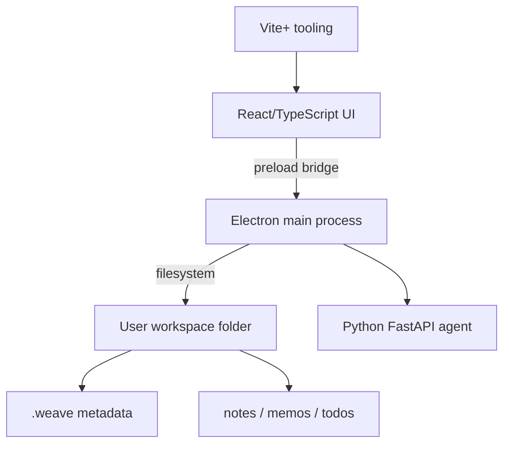

# Single Workspace First-run Setup Implementation Plan

> **For agentic workers:** REQUIRED SUB-SKILL: Use superpowers:subagent-driven-development (recommended) or superpowers:executing-plans to implement this plan task-by-task. Steps use checkbox (`- [ ]`) syntax for tracking.

**Goal:** Build Weave's first-run setup flow so the desktop app binds one local workspace folder, initializes a fixed local-first directory structure, and opens that workspace on later launches.

**Architecture:** Electron main owns filesystem access, app-local config, folder picking, and workspace initialization. The preload bridge exposes a narrow async API to the renderer. React renders one of three states: first-run setup, ready workspace shell, or recoverable missing-path setup.

**Tech Stack:** Electron, TypeScript, React, Node `fs/promises`, Vitest, Vite+ pnpm workspace.

---

## File Structure

- Modify `apps/desktop/src/shared/desktop-api.ts`: define the typed workspace API shared by preload and renderer.
- Create `apps/desktop/src/main/workspace.ts`: pure Node workspace config, validation, and initialization logic with no Electron imports.
- Create `apps/desktop/src/main/workspace.test.ts`: Vitest tests for workspace initialization and status behavior.
- Create `apps/desktop/src/main/workspace-ipc.ts`: Electron IPC handlers for status and native folder selection.
- Modify `apps/desktop/src/main/main.ts`: register workspace IPC before creating windows.
- Modify `apps/desktop/src/preload/preload.ts`: expose async workspace methods through `contextBridge`.
- Modify `apps/desktop/src/renderer/app-shell.tsx`: render first-run, ready, and missing-path states.
- Modify `apps/desktop/src/renderer/main.tsx`: load workspace status from `window.weave` and pass actions into `AppShell`.
- Modify `apps/desktop/src/renderer/styles.css`: style the setup and ready states.
- Modify `apps/desktop/src/renderer/vite-env.d.ts`: keep `window.weave` typed for the renderer.
- Modify `docs/architecture.md`, `docs/project-structure.md`, and `docs/.state.md`: update stale Tauri/Rust wording to Electron for the touched runtime boundary.

## Task 1: Shared Workspace API Types

**Files:**
- Modify: `apps/desktop/src/shared/desktop-api.ts`

- [ ] **Step 1: Replace the shared API with workspace-aware types**

```ts
export type WorkspaceStatusKind = "unconfigured" | "ready" | "missing";

export interface AppInfo {
  readonly name: string;
  readonly runtime: string;
}

export interface WorkspaceStatus {
  readonly kind: WorkspaceStatusKind;
  readonly path: string | null;
  readonly message: string | null;
}

export interface ChooseWorkspaceResult {
  readonly canceled: boolean;
  readonly status: WorkspaceStatus;
}

export const workspaceIpcChannels = {
  getStatus: "workspace:getStatus",
  choose: "workspace:choose"
} as const;

export interface DesktopApi {
  getAppInfo(): AppInfo;
  getWorkspaceStatus(): Promise<WorkspaceStatus>;
  chooseWorkspace(): Promise<ChooseWorkspaceResult>;
}
```

- [ ] **Step 2: Run renderer and main typecheck to verify expected failures**

Run: `vp run typecheck`

Expected: FAIL because `preload.ts` does not implement `getWorkspaceStatus` or `chooseWorkspace`, and renderer code still treats workspace status as synchronous starter data.

- [ ] **Step 3: Commit the shared type contract**

```bash
git add apps/desktop/src/shared/desktop-api.ts
git commit -m "feat: define workspace desktop api"
```

## Task 2: Workspace Initialization Core

**Files:**
- Create: `apps/desktop/src/main/workspace.ts`
- Create: `apps/desktop/src/main/workspace.test.ts`

- [ ] **Step 1: Write failing tests for workspace config, initialization, ready status, missing status, and unconfigured status**

Create `apps/desktop/src/main/workspace.test.ts`:

```ts
import { mkdtemp, readFile, rm, stat } from "node:fs/promises";
import os from "node:os";
import path from "node:path";
import { afterEach, describe, expect, it } from "vitest";
import {
  getWorkspaceStatus,
  initializeWorkspace,
  setWorkspacePath,
  workspaceConfigFileName,
  workspaceDirectories
} from "./workspace";

const tempRoots: string[] = [];

async function makeTempDir(prefix: string): Promise<string> {
  const dir = await mkdtemp(path.join(os.tmpdir(), prefix));
  tempRoots.push(dir);
  return dir;
}

afterEach(async () => {
  await Promise.all(tempRoots.splice(0).map((dir) => rm(dir, { force: true, recursive: true })));
});

describe("workspace", () => {
  it("initializes the fixed workspace directory structure", async () => {
    const workspacePath = await makeTempDir("weave-workspace-");

    await initializeWorkspace(workspacePath);

    await Promise.all(
      workspaceDirectories.map(async (relativePath) => {
        const directory = await stat(path.join(workspacePath, relativePath));
        expect(directory.isDirectory()).toBe(true);
      })
    );
  });

  it("writes workspace metadata config inside .weave", async () => {
    const workspacePath = await makeTempDir("weave-workspace-");

    await initializeWorkspace(workspacePath);

    const configPath = path.join(workspacePath, ".weave", workspaceConfigFileName);
    const config = JSON.parse(await readFile(configPath, "utf8")) as { version: number };
    expect(config).toEqual({ version: 1 });
  });

  it("returns unconfigured when no app config exists", async () => {
    const appDataPath = await makeTempDir("weave-appdata-");

    await expect(getWorkspaceStatus(appDataPath)).resolves.toEqual({
      kind: "unconfigured",
      path: null,
      message: "Choose a local folder to start using Weave."
    });
  });

  it("persists a configured workspace path and reports ready", async () => {
    const appDataPath = await makeTempDir("weave-appdata-");
    const workspacePath = await makeTempDir("weave-workspace-");

    await setWorkspacePath(appDataPath, workspacePath);

    await expect(getWorkspaceStatus(appDataPath)).resolves.toEqual({
      kind: "ready",
      path: workspacePath,
      message: null
    });
  });

  it("reports missing when the configured workspace path is unavailable", async () => {
    const appDataPath = await makeTempDir("weave-appdata-");
    const workspacePath = await makeTempDir("weave-workspace-");

    await setWorkspacePath(appDataPath, workspacePath);
    await rm(workspacePath, { force: true, recursive: true });

    await expect(getWorkspaceStatus(appDataPath)).resolves.toEqual({
      kind: "missing",
      path: workspacePath,
      message: "The configured workspace folder is unavailable. Choose a valid local folder."
    });
  });
});
```

- [ ] **Step 2: Run tests to verify they fail because the module does not exist**

Run: `vp run test -- --run src/main/workspace.test.ts`

Expected: FAIL with an import error for `./workspace`.

- [ ] **Step 3: Implement the workspace core**

Create `apps/desktop/src/main/workspace.ts`:

```ts
import { constants } from "node:fs";
import { access, mkdir, readFile, stat, writeFile } from "node:fs/promises";
import path from "node:path";
import type { WorkspaceStatus } from "../shared/desktop-api.js";

export const workspaceConfigFileName = "config.json";

export const workspaceDirectories = [
  ".weave",
  ".weave/indexes",
  ".weave/logs",
  "notes",
  "memos",
  "todos"
] as const;

interface AppWorkspaceConfig {
  readonly workspacePath: string;
}

interface WorkspaceMetadata {
  readonly version: 1;
}

const appConfigFileName = "workspace.json";

function appConfigPath(appDataPath: string): string {
  return path.join(appDataPath, appConfigFileName);
}

function workspaceMetadataPath(workspacePath: string): string {
  return path.join(workspacePath, ".weave", workspaceConfigFileName);
}

async function pathExists(targetPath: string): Promise<boolean> {
  try {
    await access(targetPath, constants.F_OK);
    return true;
  } catch {
    return false;
  }
}

async function readAppWorkspaceConfig(appDataPath: string): Promise<AppWorkspaceConfig | null> {
  try {
    const rawConfig = await readFile(appConfigPath(appDataPath), "utf8");
    const parsed = JSON.parse(rawConfig) as Partial<AppWorkspaceConfig>;
    return typeof parsed.workspacePath === "string" && parsed.workspacePath.length > 0
      ? { workspacePath: parsed.workspacePath }
      : null;
  } catch {
    return null;
  }
}

export async function initializeWorkspace(workspacePath: string): Promise<void> {
  const target = await stat(workspacePath);

  if (!target.isDirectory()) {
    throw new Error("Workspace path must be a folder.");
  }

  await Promise.all(
    workspaceDirectories.map((relativePath) =>
      mkdir(path.join(workspacePath, relativePath), { recursive: true })
    )
  );

  const metadata: WorkspaceMetadata = { version: 1 };
  await writeFile(workspaceMetadataPath(workspacePath), `${JSON.stringify(metadata, null, 2)}\n`, "utf8");
}

export async function setWorkspacePath(appDataPath: string, workspacePath: string): Promise<WorkspaceStatus> {
  await initializeWorkspace(workspacePath);
  await mkdir(appDataPath, { recursive: true });

  const config: AppWorkspaceConfig = { workspacePath };
  await writeFile(appConfigPath(appDataPath), `${JSON.stringify(config, null, 2)}\n`, "utf8");

  return {
    kind: "ready",
    path: workspacePath,
    message: null
  };
}

export async function getWorkspaceStatus(appDataPath: string): Promise<WorkspaceStatus> {
  const config = await readAppWorkspaceConfig(appDataPath);

  if (!config) {
    return {
      kind: "unconfigured",
      path: null,
      message: "Choose a local folder to start using Weave."
    };
  }

  if (!(await pathExists(config.workspacePath))) {
    return {
      kind: "missing",
      path: config.workspacePath,
      message: "The configured workspace folder is unavailable. Choose a valid local folder."
    };
  }

  return {
    kind: "ready",
    path: config.workspacePath,
    message: null
  };
}
```

- [ ] **Step 4: Run focused tests and typecheck**

Run: `vp run test -- --run src/main/workspace.test.ts`

Expected: PASS for 5 tests.

Run: `vp run typecheck`

Expected: still FAIL until later tasks implement the new preload and renderer API.

- [ ] **Step 5: Commit the workspace core**

```bash
git add apps/desktop/src/main/workspace.ts apps/desktop/src/main/workspace.test.ts
git commit -m "feat: initialize local workspace structure"
```

## Task 3: Electron IPC and Preload Bridge

**Files:**
- Create: `apps/desktop/src/main/workspace-ipc.ts`
- Modify: `apps/desktop/src/main/main.ts`
- Modify: `apps/desktop/src/preload/preload.ts`

- [ ] **Step 1: Add IPC handlers for workspace status and folder selection**

Create `apps/desktop/src/main/workspace-ipc.ts`:

```ts
import { app, BrowserWindow, dialog, ipcMain } from "electron";
import { workspaceIpcChannels, type ChooseWorkspaceResult } from "../shared/desktop-api.js";
import { getWorkspaceStatus, setWorkspacePath } from "./workspace.js";

export function registerWorkspaceIpc(): void {
  ipcMain.handle(workspaceIpcChannels.getStatus, async () => {
    return getWorkspaceStatus(app.getPath("userData"));
  });

  ipcMain.handle(workspaceIpcChannels.choose, async (event): Promise<ChooseWorkspaceResult> => {
    const parentWindow = BrowserWindow.fromWebContents(event.sender) ?? undefined;
    const result = await dialog.showOpenDialog(parentWindow, {
      buttonLabel: "Use this folder",
      message: "Choose your Weave workspace folder",
      properties: ["openDirectory", "createDirectory"]
    });

    if (result.canceled || result.filePaths.length === 0) {
      return {
        canceled: true,
        status: await getWorkspaceStatus(app.getPath("userData"))
      };
    }

    return {
      canceled: false,
      status: await setWorkspacePath(app.getPath("userData"), result.filePaths[0])
    };
  });
}
```

- [ ] **Step 2: Register IPC before creating the first window**

Modify `apps/desktop/src/main/main.ts`:

```ts
import { app, BrowserWindow } from "electron";
import path from "node:path";
import { fileURLToPath } from "node:url";
import { registerWorkspaceIpc } from "./workspace-ipc.js";

const currentFile = fileURLToPath(import.meta.url);
const currentDir = path.dirname(currentFile);

function createMainWindow(): BrowserWindow {
  const window = new BrowserWindow({
    width: 1180,
    height: 820,
    minWidth: 900,
    minHeight: 640,
    title: "Weave",
    webPreferences: {
      contextIsolation: true,
      nodeIntegration: false,
      preload: path.join(currentDir, "../preload/preload.js")
    }
  });

  if (app.isPackaged) {
    void window.loadFile(path.join(currentDir, "../renderer/index.html"));
  } else {
    void window.loadURL(process.env.WEAVE_RENDERER_URL ?? "http://127.0.0.1:5173");
    window.webContents.openDevTools({ mode: "detach" });
  }

  return window;
}

void app.whenReady().then(() => {
  registerWorkspaceIpc();
  createMainWindow();

  app.on("activate", () => {
    if (BrowserWindow.getAllWindows().length === 0) {
      createMainWindow();
    }
  });
});

app.on("window-all-closed", () => {
  if (process.platform !== "darwin") {
    app.quit();
  }
});
```

- [ ] **Step 3: Expose async workspace methods from preload**

Modify `apps/desktop/src/preload/preload.ts`:

```ts
import { contextBridge, ipcRenderer } from "electron";
import { workspaceIpcChannels, type DesktopApi } from "../shared/desktop-api.js";

const desktopApi: DesktopApi = {
  getAppInfo: () => ({
    name: "Weave",
    runtime: "electron"
  }),
  getWorkspaceStatus: () => ipcRenderer.invoke(workspaceIpcChannels.getStatus),
  chooseWorkspace: () => ipcRenderer.invoke(workspaceIpcChannels.choose)
};

contextBridge.exposeInMainWorld("weave", desktopApi);
```

- [ ] **Step 4: Run main typecheck**

Run: `pnpm --filter @weave/desktop typecheck`

Expected: FAIL only in renderer files until Task 4 adapts `AppShell` and `main.tsx`.

- [ ] **Step 5: Commit the desktop bridge**

```bash
git add apps/desktop/src/main/main.ts apps/desktop/src/main/workspace-ipc.ts apps/desktop/src/preload/preload.ts
git commit -m "feat: bridge workspace setup through electron"
```

## Task 4: Renderer First-run and Ready States

**Files:**
- Modify: `apps/desktop/src/renderer/app-shell.tsx`
- Modify: `apps/desktop/src/renderer/main.tsx`
- Modify: `apps/desktop/src/renderer/vite-env.d.ts`
- Modify: `apps/desktop/src/renderer/styles.css`

- [ ] **Step 1: Type the global desktop API in the renderer**

Modify `apps/desktop/src/renderer/vite-env.d.ts`:

```ts
/// <reference types="vite/client" />

import type { DesktopApi } from "../shared/desktop-api";

declare global {
  interface Window {
    readonly weave?: DesktopApi;
  }
}
```

- [ ] **Step 2: Replace AppShell with state-based UI**

Modify `apps/desktop/src/renderer/app-shell.tsx`:

```tsx
import type { WorkspaceStatus } from "../shared/desktop-api";
import type { WorkspaceSummary } from "./starter-workspace";

export interface AppShellProps {
  readonly workspace: WorkspaceSummary;
  readonly runtimeName: string;
  readonly status: WorkspaceStatus;
  readonly isChoosingWorkspace: boolean;
  readonly onChooseWorkspace: () => void;
}

function WorkspaceSetup({
  status,
  isChoosingWorkspace,
  onChooseWorkspace
}: Pick<AppShellProps, "status" | "isChoosingWorkspace" | "onChooseWorkspace">) {
  const isMissing = status.kind === "missing";

  return (
    <main className="setup-shell">
      <section className="setup-panel" aria-labelledby="setup-title">
        <p className="eyebrow">local-first setup</p>
        <h1 id="setup-title">{isMissing ? "重新选择 Weave 文件夹" : "选择你的 Weave 文件夹"}</h1>
        <p className="setup-copy">
          Weave 会在这个文件夹里创建 <code>.weave/</code>, <code>notes/</code>,{" "}
          <code>memos/</code>, 和 <code>todos/</code>。这个文件夹就是你的本地资料根目录。
        </p>
        {status.message ? <p className="setup-message">{status.message}</p> : null}
        {status.path ? <p className="setup-path">当前路径：{status.path}</p> : null}
        <button className="primary-action" type="button" onClick={onChooseWorkspace} disabled={isChoosingWorkspace}>
          {isChoosingWorkspace ? "正在打开..." : "选择文件夹"}
        </button>
      </section>
    </main>
  );
}

export function AppShell({
  workspace,
  runtimeName,
  status,
  isChoosingWorkspace,
  onChooseWorkspace
}: AppShellProps) {
  if (status.kind !== "ready") {
    return (
      <WorkspaceSetup
        status={status}
        isChoosingWorkspace={isChoosingWorkspace}
        onChooseWorkspace={onChooseWorkspace}
      />
    );
  }

  return (
    <main className="app-shell">
      <header className="hero">
        <p className="eyebrow">{runtimeName} / {status.path}</p>
        <h1>Weave</h1>
      </header>

      <section className="entry-grid" aria-label={workspace.name}>
        {workspace.entries.map((entry) => (
          <article className="entry-card" key={entry.id}>
            <p className="entry-meta">
              {entry.kind.toUpperCase()} · {entry.updatedAt}
            </p>
            <h2>{entry.title}</h2>
            <p>{entry.summary}</p>
          </article>
        ))}
      </section>
    </main>
  );
}
```

- [ ] **Step 3: Load workspace status in renderer bootstrap**

Modify `apps/desktop/src/renderer/main.tsx`:

```tsx
import React, { useEffect, useState } from "react";
import { createRoot } from "react-dom/client";
import type { WorkspaceStatus } from "../shared/desktop-api";
import { AppShell } from "./app-shell";
import { createStarterWorkspace } from "./starter-workspace";
import "./styles.css";

const rootElement = document.getElementById("root");

if (!rootElement) {
  throw new Error("Renderer root element was not found.");
}

const workspace = createStarterWorkspace();
const appInfo = window.weave?.getAppInfo();

const fallbackStatus: WorkspaceStatus = {
  kind: "unconfigured",
  path: null,
  message: "Desktop workspace APIs are unavailable."
};

function RootApp() {
  const [status, setStatus] = useState<WorkspaceStatus | null>(null);
  const [isChoosingWorkspace, setIsChoosingWorkspace] = useState(false);

  useEffect(() => {
    let isMounted = true;

    async function loadStatus() {
      const nextStatus = window.weave ? await window.weave.getWorkspaceStatus() : fallbackStatus;
      if (isMounted) {
        setStatus(nextStatus);
      }
    }

    void loadStatus();

    return () => {
      isMounted = false;
    };
  }, []);

  async function chooseWorkspace() {
    if (!window.weave) {
      setStatus(fallbackStatus);
      return;
    }

    setIsChoosingWorkspace(true);
    try {
      const result = await window.weave.chooseWorkspace();
      setStatus(result.status);
    } finally {
      setIsChoosingWorkspace(false);
    }
  }

  if (!status) {
    return (
      <main className="setup-shell">
        <section className="setup-panel" aria-label="Loading workspace">
          <p className="eyebrow">local-first setup</p>
          <h1>正在加载 Weave</h1>
        </section>
      </main>
    );
  }

  return (
    <AppShell
      workspace={workspace}
      runtimeName={appInfo?.runtime ?? "browser"}
      status={status}
      isChoosingWorkspace={isChoosingWorkspace}
      onChooseWorkspace={chooseWorkspace}
    />
  );
}

createRoot(rootElement).render(
  <React.StrictMode>
    <RootApp />
  </React.StrictMode>
);
```

- [ ] **Step 4: Add setup UI styles**

Append to `apps/desktop/src/renderer/styles.css`:

```css
.setup-shell {
  min-height: 100vh;
  display: grid;
  place-items: center;
  padding: 32px;
}

.setup-panel {
  width: min(680px, 100%);
  display: grid;
  gap: 18px;
}

.setup-copy {
  margin: 0;
  color: #4b5552;
  font-size: 17px;
  line-height: 1.7;
}

.setup-copy code {
  color: #1e2528;
  background: #ebe5da;
  border-radius: 4px;
  padding: 2px 5px;
}

.setup-message,
.setup-path {
  margin: 0;
  color: #66706d;
  line-height: 1.5;
}

.primary-action {
  width: fit-content;
  border: 0;
  border-radius: 8px;
  background: #1e2528;
  color: #fffdf9;
  padding: 12px 18px;
  cursor: pointer;
}

.primary-action:disabled {
  cursor: default;
  opacity: 0.6;
}
```

- [ ] **Step 5: Run typecheck and tests**

Run: `vp run check`

Expected: PASS.

- [ ] **Step 6: Commit renderer first-run flow**

```bash
git add apps/desktop/src/renderer/app-shell.tsx apps/desktop/src/renderer/main.tsx apps/desktop/src/renderer/vite-env.d.ts apps/desktop/src/renderer/styles.css
git commit -m "feat: add first-run workspace setup ui"
```

## Task 5: Settings Entry for Workspace Path Changes

**Files:**
- Modify: `apps/desktop/src/renderer/app-shell.tsx`
- Modify: `apps/desktop/src/renderer/styles.css`

- [ ] **Step 1: Add a minimal settings section to ready state**

In the ready-state return of `apps/desktop/src/renderer/app-shell.tsx`, add this section after the `entry-grid` section:

```tsx
      <section className="settings-strip" aria-label="Workspace settings">
        <div>
          <p className="entry-meta">WORKSPACE</p>
          <p className="settings-path">{status.path}</p>
        </div>
        <button className="secondary-action" type="button" onClick={onChooseWorkspace} disabled={isChoosingWorkspace}>
          {isChoosingWorkspace ? "正在打开..." : "更改文件夹"}
        </button>
      </section>
```

- [ ] **Step 2: Add settings styles**

Append to `apps/desktop/src/renderer/styles.css`:

```css
.settings-strip {
  border-top: 1px solid #d8d2c7;
  display: flex;
  align-items: center;
  justify-content: space-between;
  gap: 20px;
  padding-top: 20px;
}

.settings-path {
  margin: 0;
  color: #4b5552;
  overflow-wrap: anywhere;
}

.secondary-action {
  border: 1px solid #c8c0b2;
  border-radius: 8px;
  background: #fffdf9;
  color: #1e2528;
  padding: 10px 14px;
  cursor: pointer;
  white-space: nowrap;
}

.secondary-action:disabled {
  cursor: default;
  opacity: 0.6;
}
```

- [ ] **Step 3: Run typecheck and tests**

Run: `vp run check`

Expected: PASS.

- [ ] **Step 4: Commit settings path change entry**

```bash
git add apps/desktop/src/renderer/app-shell.tsx apps/desktop/src/renderer/styles.css
git commit -m "feat: expose workspace path in settings"
```

## Task 6: Runtime Documentation Refresh

**Files:**
- Modify: `docs/architecture.md`
- Modify: `docs/project-structure.md`
- Modify: `docs/.state.md`

- [ ] **Step 1: Update architecture runtime wording**

Replace the Tauri/Rust runtime shape in `docs/architecture.md` with this Electron wording:

````markdown
# Current Architecture



Weave is a local-first desktop app with a React renderer, an Electron main process for desktop-local responsibilities, and a Python FastAPI service reserved for future agent behavior. The current product path binds one local workspace folder before the main app shell opens.

## Runtime Shape

- Vite+ manages JavaScript workspace tooling and commands.
- React renders first-run setup, recoverable workspace states, and the desktop app shell.
- Electron preload exposes a narrow typed bridge from renderer to main.
- Electron main owns native folder picking, app-local configuration, and local workspace initialization.
- The selected workspace stores visible content in `notes/`, `memos/`, and `todos/`, with internal metadata under `.weave/`.
- Python remains the home for future agent behavior, but workspace setup does not require the Python service.
````

Keep the existing verification section, but replace stale Cargo/Tauri verification with:

```markdown
- `pnpm --filter @weave/desktop typecheck` verifies frontend, preload, and main-process types.
- `pnpm --filter @weave/desktop test` verifies TypeScript tests.
- Manual Electron verification confirms native folder picking and persisted workspace startup.
```

- [ ] **Step 2: Update project structure wording**

In `docs/project-structure.md`, replace Tauri/Rust ownership references with Electron main/preload ownership and add the single workspace structure:

````markdown
Desktop runtime ownership:

- `apps/desktop/src/renderer/` owns React UI.
- `apps/desktop/src/main/` owns Electron main-process behavior, native dialogs, app-local config, and filesystem setup.
- `apps/desktop/src/preload/` owns the safe renderer bridge.
- `apps/desktop/src/shared/` owns shared TypeScript API contracts.

Initialized workspace structure:

```text
SelectedFolder/
  .weave/
    config.json
    indexes/
    logs/
  notes/
  memos/
  todos/
```
````

- [ ] **Step 3: Update knowledge-base state**

Add this bullet to `docs/.state.md` under current state or coverage:

```markdown
- First-run setup is designed and implemented as a single-workspace Electron flow: the user chooses one local folder, Weave initializes `.weave/`, `notes/`, `memos/`, and `todos/`, and later launches open that configured workspace directly.
```

- [ ] **Step 4: Run documentation grep for stale critical Tauri claims**

Run: `rg -n "Tauri|Rust bridge|src-tauri|get_runtime_status|agent_discover" docs apps/desktop/src`

Expected: no stale references in current architecture/project-structure docs. References inside old historical decision records are acceptable only if they are clearly historical.

- [ ] **Step 5: Commit documentation refresh**

```bash
git add docs/architecture.md docs/project-structure.md docs/.state.md
git commit -m "docs: refresh electron workspace architecture"
```

## Task 7: Manual Electron Verification

**Files:**
- No code edits expected.

- [ ] **Step 1: Clear local Electron app config for a fresh first-run check**

Run:

```bash
rm -f "$HOME/Library/Application Support/@weave/desktop/workspace.json"
```

Expected: command exits 0.

- [ ] **Step 2: Start the desktop app**

Run: `vp run desktop:dev`

Expected:

- Vite prints `Local: http://127.0.0.1:5173/`.
- TypeScript watch prints `Found 0 errors`.
- Electron launches the app.

- [ ] **Step 3: Verify first-run setup**

In Electron:

- Confirm the setup page appears.
- Click `选择文件夹`.
- Choose a temporary local folder such as `/tmp/weave-manual-workspace`.
- Confirm the app enters the main shell.

- [ ] **Step 4: Verify initialized directories**

Run:

```bash
find /tmp/weave-manual-workspace -maxdepth 2 -type d | sort
```

Expected output includes:

```text
/tmp/weave-manual-workspace
/tmp/weave-manual-workspace/.weave
/tmp/weave-manual-workspace/.weave/indexes
/tmp/weave-manual-workspace/.weave/logs
/tmp/weave-manual-workspace/memos
/tmp/weave-manual-workspace/notes
/tmp/weave-manual-workspace/todos
```

- [ ] **Step 5: Verify persisted startup**

Quit Electron and restart with `vp run desktop:dev`.

Expected: app opens directly to the main shell and displays the configured workspace path.

- [ ] **Step 6: Verify missing-path recovery**

Run:

```bash
rm -rf /tmp/weave-manual-workspace
```

Restart Electron.

Expected: app shows the recovery setup page with the unavailable path and lets the user choose a new folder.

- [ ] **Step 7: Run final automated checks**

Run: `vp run check`

Expected: PASS.

- [ ] **Step 8: Commit verification-only cleanup if needed**

If manual verification created tracked files, remove or ignore them. If `git status --short` shows only expected source/doc changes already committed, do not create a commit.

## Self-Review

Spec coverage:

- First-run setup is covered by Tasks 3, 4, and 7.
- Fixed workspace directory initialization is covered by Task 2 and Task 7.
- Persistence across restart is covered by Tasks 2, 3, and 7.
- Missing-path recovery is covered by Tasks 2, 4, and 7.
- Settings path change is covered by Task 5.
- Desktop filesystem boundary is covered by Tasks 1, 3, and 4.
- Documentation updates are covered by Task 6.

Placeholder scan:

- The plan contains no placeholder markers or unspecified implementation steps.

Type consistency:

- `WorkspaceStatus.kind`, `WorkspaceStatus.path`, `WorkspaceStatus.message`, `ChooseWorkspaceResult.canceled`, and `ChooseWorkspaceResult.status` are defined in Task 1 and used consistently in later tasks.
